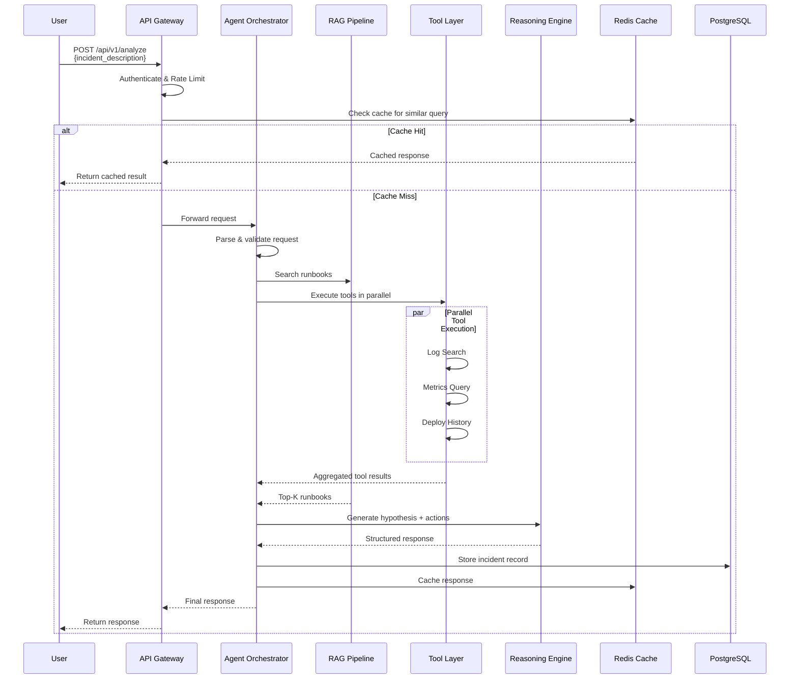
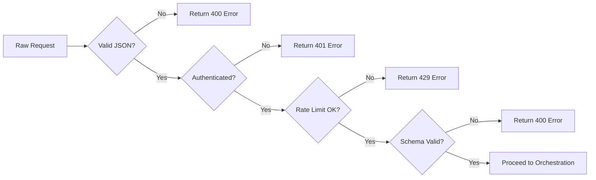
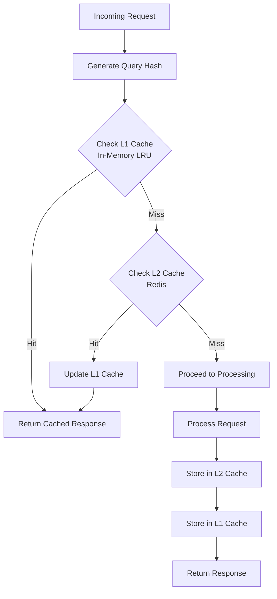
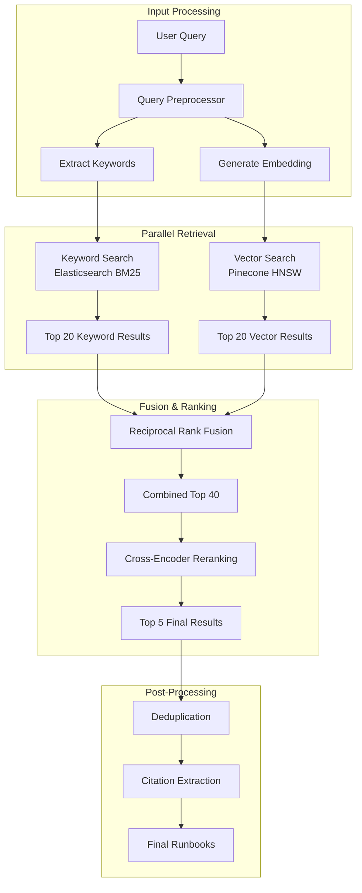
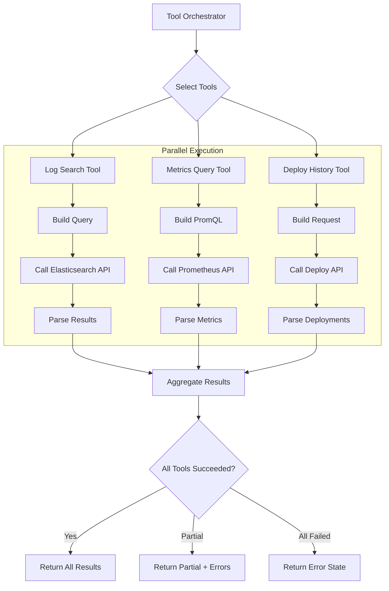
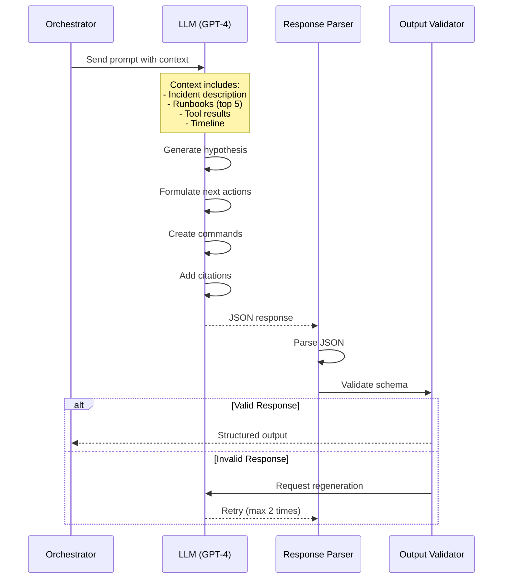
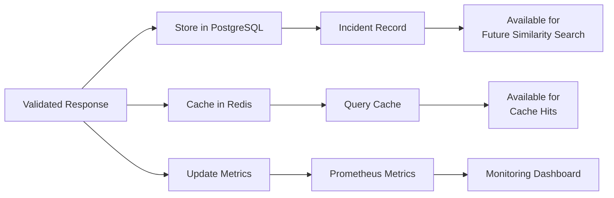
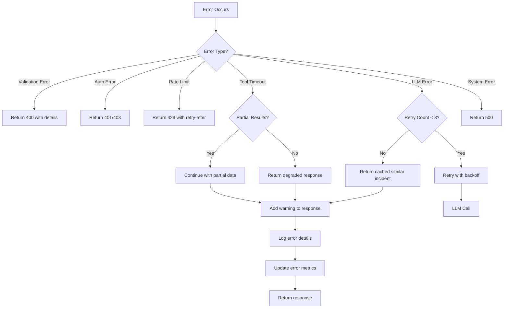

# Ops Copilot - Data Flow Document

## 1. Overview

This document describes the end-to-end data flow through the Ops Copilot system, from incident query to actionable response. It covers request processing, tool orchestration, RAG pipeline, and response generation.

---

## 2. High-Level Request Flow



**Key Metrics:**
- **Total Latency Target**: < 10s (p95)
- **Cache Hit Rate**: > 30%
- **Tool Execution**: 3-5s
- **LLM Generation**: 2-4s

---

## 3. Detailed Data Flow Stages

### Stage 1: Request Ingestion & Validation



**Input Validation:**
```python
class AnalyzeRequest(BaseModel):
    incident_description: str = Field(min_length=10, max_length=5000)
    incident_id: Optional[str] = Field(pattern=r'^INC-\d+$')
    context: Optional[Dict[str, str]] = Field(default_factory=dict)
    options: Optional[RequestOptions] = Field(default_factory=RequestOptions)
    
    @validator('incident_description')
    def validate_description(cls, v):
        if not v.strip():
            raise ValueError("Description cannot be empty")
        return v.strip()
```

**Data Transformations:**
1. Trim whitespace
2. Normalize incident ID format
3. Extract service name from context
4. Generate request correlation ID

**Output:**
```python
{
    "correlation_id": "req_abc123",
    "user_id": "user_xyz",
    "incident_description": "API service returning 500 errors...",
    "context": {"service": "api-gateway", "env": "prod"},
    "timestamp": "2025-12-20T00:57:50Z"
}
```

---

### Stage 2: Cache Lookup



**Cache Key Generation:**
```python
import hashlib
import json

def generate_cache_key(request: AnalyzeRequest) -> str:
    # Normalize request for consistent hashing
    normalized = {
        "description": request.incident_description.lower().strip(),
        "service": request.context.get("service", ""),
        "env": request.context.get("environment", ""),
    }
    
    # Create deterministic hash
    content = json.dumps(normalized, sort_keys=True)
    hash_digest = hashlib.sha256(content.encode()).hexdigest()
    
    return f"query:result:{hash_digest[:16]}"
```

**Cache Storage:**
```python
# Redis structure
{
    "key": "query:result:a1b2c3d4e5f6g7h8",
    "value": {
        "response": {...},  # Full structured response
        "created_at": "2025-12-20T00:57:50Z",
        "hit_count": 5
    },
    "ttl": 3600  # 1 hour
}
```

**Cache Invalidation:**
- Time-based: TTL of 1 hour
- Event-based: New runbook deployment, service updates

---

### Stage 3: RAG Pipeline (Hybrid Retrieval)



#### 3.1 Query Preprocessing

**Input:**
```python
{
    "query": "API service returning 500 errors since 2pm",
    "service": "api-gateway"
}
```

**Processing Steps:**
1. **Tokenization**: Split into terms
2. **Stopword Removal**: Remove "the", "is", "a", etc.
3. **Keyword Extraction**: "API", "500 errors", "api-gateway"
4. **Embedding Generation**: Convert to 1536-dim vector

**Output:**
```python
{
    "keywords": ["API", "500", "errors", "api-gateway"],
    "embedding": [0.123, -0.456, ...],  # 1536 dimensions
    "filters": {"service": "api-gateway"}
}
```

#### 3.2 Keyword Search (Elasticsearch)

**Query DSL:**
```json
{
  "query": {
    "bool": {
      "must": [
        {
          "multi_match": {
            "query": "API 500 errors",
            "fields": ["title^3", "content^1", "tags^2"],
            "type": "best_fields"
          }
        }
      ],
      "filter": [
        {"term": {"service": "api-gateway"}}
      ]
    }
  },
  "size": 20,
  "_source": ["id", "title", "content", "service", "tags"]
}
```

**Scoring:**
- BM25 algorithm with custom parameters (k1=1.5, b=0.75)
- Field boosting: title (3x), tags (2x), content (1x)

**Output:**
```python
[
    {
        "id": "rb_001",
        "title": "Debugging 500 Errors in API Gateway",
        "score": 12.34,
        "content": "When API gateway returns 500...",
        "service": "api-gateway"
    },
    # ... 19 more results
]
```

#### 3.3 Vector Search (Pinecone)

**Query:**
```python
import pinecone

index = pinecone.Index("runbooks")

results = index.query(
    vector=query_embedding,  # 1536-dim vector
    top_k=20,
    filter={"service": {"$eq": "api-gateway"}},
    include_metadata=True
)
```

**Output:**
```python
{
    "matches": [
        {
            "id": "rb_042",
            "score": 0.89,  # Cosine similarity
            "metadata": {
                "title": "API Gateway Error Troubleshooting",
                "content": "...",
                "service": "api-gateway"
            }
        },
        # ... 19 more results
    ]
}
```

#### 3.4 Reciprocal Rank Fusion (RRF)

**Algorithm:**
```python
def reciprocal_rank_fusion(
    keyword_results: List[Dict],
    vector_results: List[Dict],
    k: int = 60
) -> List[Dict]:
    """
    Combine results from multiple retrievers using RRF.
    Score = sum(1 / (k + rank_i)) for each retriever
    """
    scores = defaultdict(float)
    docs = {}
    
    # Score keyword results
    for rank, doc in enumerate(keyword_results, start=1):
        doc_id = doc['id']
        scores[doc_id] += 1 / (k + rank)
        docs[doc_id] = doc
    
    # Score vector results
    for rank, doc in enumerate(vector_results, start=1):
        doc_id = doc['id']
        scores[doc_id] += 1 / (k + rank)
        if doc_id not in docs:
            docs[doc_id] = doc
    
    # Sort by combined score
    ranked = sorted(scores.items(), key=lambda x: x[1], reverse=True)
    
    return [docs[doc_id] for doc_id, _ in ranked[:40]]
```

**Output:**
```python
[
    {"id": "rb_001", "rrf_score": 0.0483, ...},  # High in both
    {"id": "rb_042", "rrf_score": 0.0421, ...},  # High in vector
    {"id": "rb_015", "rrf_score": 0.0389, ...},  # High in keyword
    # ... 37 more
]
```

#### 3.5 Cross-Encoder Reranking

**Model:** `cross-encoder/ms-marco-MiniLM-L-12-v2`

**Process:**
```python
from sentence_transformers import CrossEncoder

model = CrossEncoder('cross-encoder/ms-marco-MiniLM-L-12-v2')

# Create query-document pairs
pairs = [
    [query, doc['content']] 
    for doc in rrf_results
]

# Get relevance scores
scores = model.predict(pairs)

# Rerank by score
reranked = sorted(
    zip(rrf_results, scores),
    key=lambda x: x[1],
    reverse=True
)[:5]
```

**Output:**
```python
[
    {
        "id": "rb_001",
        "title": "Debugging 500 Errors in API Gateway",
        "rerank_score": 0.94,
        "content": "...",
        "url": "https://runbooks.company.com/rb_001"
    },
    # ... 4 more
]
```

#### 3.6 Deduplication

**Method:** Cosine similarity on content embeddings

```python
def deduplicate_results(results: List[Dict], threshold: float = 0.95) -> List[Dict]:
    """Remove near-duplicate documents"""
    unique_results = []
    seen_embeddings = []
    
    for doc in results:
        is_duplicate = False
        doc_embedding = doc.get('embedding')
        
        for seen_emb in seen_embeddings:
            similarity = cosine_similarity(doc_embedding, seen_emb)
            if similarity > threshold:
                is_duplicate = True
                break
        
        if not is_duplicate:
            unique_results.append(doc)
            seen_embeddings.append(doc_embedding)
    
    return unique_results
```

---

### Stage 4: Tool Execution



#### 4.1 Log Search Tool Flow

**Input:**
```python
{
    "query": "status:500 AND service:api-gateway",
    "time_range": "last_1h",
    "max_results": 100
}
```

**Elasticsearch Query:**
```json
{
  "query": {
    "bool": {
      "must": [
        {"match": {"message": "500"}},
        {"term": {"service": "api-gateway"}},
        {
          "range": {
            "timestamp": {
              "gte": "now-1h",
              "lte": "now"
            }
          }
        }
      ]
    }
  },
  "sort": [{"timestamp": "desc"}],
  "size": 100
}
```

**Output:**
```python
{
    "success": True,
    "data": {
        "logs": [
            {
                "timestamp": "2025-12-20T00:45:00Z",
                "level": "ERROR",
                "service": "api-gateway",
                "message": "HTTP 500: Database connection timeout",
                "trace_id": "abc123"
            },
            # ... more logs
        ],
        "total_count": 247,
        "error_pattern": "Database connection timeout (78% of errors)"
    },
    "execution_time_ms": 1234
}
```

#### 4.2 Metrics Query Tool Flow

**Input:**
```python
{
    "metric_name": "http_requests_total",
    "time_range": "last_1h",
    "aggregation": "rate",
    "dimensions": {"service": "api-gateway", "status": "500"}
}
```

**PromQL Query:**
```promql
rate(http_requests_total{service="api-gateway", status="500"}[5m])
```

**Output:**
```python
{
    "success": True,
    "data": {
        "data_points": [
            {"timestamp": "2025-12-20T00:30:00Z", "value": 2.3},
            {"timestamp": "2025-12-20T00:35:00Z", "value": 15.7},
            {"timestamp": "2025-12-20T00:40:00Z", "value": 23.4},
            # ... more points
        ],
        "metadata": {
            "spike_detected": True,
            "spike_start": "2025-12-20T00:35:00Z",
            "baseline": 2.1,
            "peak": 23.4
        }
    },
    "execution_time_ms": 876
}
```

#### 4.3 Deploy History Tool Flow

**Input:**
```python
{
    "service": "api-gateway",
    "time_range": "last_6h",
    "limit": 10
}
```

**API Call:**
```bash
GET /api/deployments?service=api-gateway&since=2025-12-19T18:57:50Z&limit=10
```

**Output:**
```python
{
    "success": True,
    "data": {
        "deployments": [
            {
                "version": "v2.3.5",
                "timestamp": "2025-12-20T00:30:00Z",
                "author": "john.doe@company.com",
                "status": "completed",
                "changes": ["Updated database driver", "Fixed memory leak"],
                "rollback_available": True
            },
            # ... more deployments
        ],
        "correlation": {
            "incident_start": "2025-12-20T00:35:00Z",
            "deployment_time": "2025-12-20T00:30:00Z",
            "time_diff_minutes": 5,
            "likely_related": True
        }
    },
    "execution_time_ms": 543
}
```

#### 4.4 Tool Result Aggregation

```python
class ToolAggregator:
    def aggregate(self, tool_results: Dict[str, ToolOutput]) -> Dict[str, Any]:
        """Combine and correlate tool outputs"""
        
        aggregated = {
            "evidence": [],
            "timeline": [],
            "correlations": []
        }
        
        # Extract evidence from logs
        if tool_results.get("log_search", {}).get("success"):
            logs = tool_results["log_search"]["data"]["logs"]
            aggregated["evidence"].append({
                "source": "logs",
                "finding": tool_results["log_search"]["data"]["error_pattern"],
                "count": len(logs)
            })
        
        # Extract metrics anomalies
        if tool_results.get("metrics_query", {}).get("success"):
            metrics = tool_results["metrics_query"]["data"]
            if metrics["metadata"]["spike_detected"]:
                aggregated["evidence"].append({
                    "source": "metrics",
                    "finding": f"Error rate spike: {metrics['metadata']['peak']} req/s",
                    "baseline": metrics["metadata"]["baseline"]
                })
        
        # Correlate deployment with incident
        if tool_results.get("deploy_history", {}).get("success"):
            deploy = tool_results["deploy_history"]["data"]
            if deploy["correlation"]["likely_related"]:
                aggregated["correlations"].append({
                    "type": "deployment",
                    "confidence": 0.85,
                    "details": deploy["deployments"][0]
                })
        
        # Build timeline
        aggregated["timeline"] = self._build_timeline(tool_results)
        
        return aggregated
    
    def _build_timeline(self, tool_results: Dict) -> List[Dict]:
        """Create chronological timeline of events"""
        events = []
        
        # Add deployment events
        for deploy in tool_results.get("deploy_history", {}).get("data", {}).get("deployments", []):
            events.append({
                "timestamp": deploy["timestamp"],
                "type": "deployment",
                "description": f"Deployed {deploy['version']}"
            })
        
        # Add metric spikes
        if tool_results.get("metrics_query", {}).get("data", {}).get("metadata", {}).get("spike_detected"):
            spike_time = tool_results["metrics_query"]["data"]["metadata"]["spike_start"]
            events.append({
                "timestamp": spike_time,
                "type": "anomaly",
                "description": "Error rate spike detected"
            })
        
        # Sort chronologically
        return sorted(events, key=lambda x: x["timestamp"])
```

**Aggregated Output:**
```python
{
    "evidence": [
        {
            "source": "logs",
            "finding": "Database connection timeout (78% of errors)",
            "count": 247
        },
        {
            "source": "metrics",
            "finding": "Error rate spike: 23.4 req/s",
            "baseline": 2.1
        }
    ],
    "timeline": [
        {
            "timestamp": "2025-12-20T00:30:00Z",
            "type": "deployment",
            "description": "Deployed v2.3.5"
        },
        {
            "timestamp": "2025-12-20T00:35:00Z",
            "type": "anomaly",
            "description": "Error rate spike detected"
        }
    ],
    "correlations": [
        {
            "type": "deployment",
            "confidence": 0.85,
            "details": {
                "version": "v2.3.5",
                "changes": ["Updated database driver", "Fixed memory leak"]
            }
        }
    ]
}
```

---

### Stage 5: LLM Reasoning & Response Generation



#### 5.1 Prompt Construction

**System Prompt:**
```python
SYSTEM_PROMPT = """
You are an expert SRE assistant analyzing production incidents.

CONTEXT:
- Incident: {incident_description}
- Service: {service}
- Environment: {environment}

AVAILABLE EVIDENCE:
{evidence_summary}

RUNBOOKS:
{runbook_excerpts}

TIMELINE:
{timeline}

YOUR TASK:
1. Analyze the evidence and form a hypothesis about the root cause
2. Suggest 3-5 prioritized next actions
3. Provide specific commands to run (if applicable)
4. Cite all sources for your claims

CRITICAL RULES:
- Be concise and actionable
- Prioritize high-impact actions first
- Only suggest commands that are safe to run
- Always cite your sources
- If uncertain, say so explicitly

Respond in the required JSON format.
"""
```

**Constructed Prompt Example:**
```
You are an expert SRE assistant analyzing production incidents.

CONTEXT:
- Incident: API service returning 500 errors since 2pm
- Service: api-gateway
- Environment: production

AVAILABLE EVIDENCE:
1. Logs show "Database connection timeout" (78% of 247 errors)
2. Error rate spiked from 2.1 to 23.4 req/s at 00:35 UTC
3. Deployment v2.3.5 completed at 00:30 UTC (5 min before spike)
4. Recent changes: "Updated database driver", "Fixed memory leak"

RUNBOOKS:
[1] "Debugging 500 Errors in API Gateway" (score: 0.94)
    - Check database connection pool settings
    - Verify database driver compatibility
    - Review recent deployments
    
[2] "Database Connection Timeouts" (score: 0.91)
    - Increase connection pool size
    - Check database load
    - Verify network connectivity

TIMELINE:
- 00:30 UTC: Deployed v2.3.5
- 00:35 UTC: Error rate spike detected

YOUR TASK:
[... rest of prompt ...]
```

#### 5.2 LLM API Call

```python
import openai

async def generate_response(prompt: str) -> Dict[str, Any]:
    """Call LLM API with structured output"""
    
    response = await openai.ChatCompletion.acreate(
        model="gpt-4-turbo-preview",
        messages=[
            {"role": "system", "content": SYSTEM_PROMPT},
            {"role": "user", "content": prompt}
        ],
        temperature=0.1,  # Low for consistency
        max_tokens=2000,
        response_format={"type": "json_object"},  # Force JSON
        timeout=20
    )
    
    return json.loads(response.choices[0].message.content)
```

#### 5.3 LLM Output (Raw)

```json
{
  "hypothesis": "The v2.3.5 deployment introduced a database driver incompatibility, causing connection pool exhaustion and timeouts. The updated driver likely has different connection handling behavior.",
  "confidence": 0.85,
  "reasoning": "Evidence strongly correlates deployment timing (00:30) with error spike (00:35). Log pattern shows consistent 'Database connection timeout' errors (78% of failures). Recent change 'Updated database driver' is a likely culprit.",
  "next_actions": [
    {
      "action": "Rollback to v2.3.4 immediately to restore service",
      "priority": "high",
      "estimated_time": "5 minutes",
      "rationale": "Fastest path to mitigation given strong deployment correlation"
    },
    {
      "action": "Check database connection pool metrics",
      "priority": "high",
      "estimated_time": "2 minutes",
      "rationale": "Verify hypothesis about pool exhaustion"
    },
    {
      "action": "Review database driver changelog for breaking changes",
      "priority": "medium",
      "estimated_time": "15 minutes",
      "rationale": "Understand root cause for permanent fix"
    },
    {
      "action": "Increase connection pool size as temporary mitigation",
      "priority": "medium",
      "estimated_time": "10 minutes",
      "rationale": "Alternative if rollback is not feasible"
    }
  ],
  "commands": [
    {
      "description": "Rollback API gateway to previous version",
      "command": "kubectl rollout undo deployment/api-gateway -n production",
      "safe_to_run": false
    },
    {
      "description": "Check current database connection pool metrics",
      "command": "curl 'http://prometheus:9090/api/v1/query?query=db_connection_pool_active{service=\"api-gateway\"}'",
      "safe_to_run": true
    },
    {
      "description": "View recent error logs",
      "command": "kubectl logs -n production deployment/api-gateway --since=1h | grep ERROR | tail -50",
      "safe_to_run": true
    }
  ],
  "citations": [
    {
      "source": "logs",
      "reference": "Elasticsearch query: status:500 AND service:api-gateway",
      "excerpt": "Database connection timeout (78% of 247 errors)",
      "timestamp": "2025-12-20T00:45:00Z"
    },
    {
      "source": "metrics",
      "reference": "Prometheus: http_requests_total{status=\"500\"}",
      "excerpt": "Error rate spike from 2.1 to 23.4 req/s",
      "timestamp": "2025-12-20T00:35:00Z"
    },
    {
      "source": "deployment",
      "reference": "Deploy API: /api/deployments/v2.3.5",
      "excerpt": "Changes: Updated database driver, Fixed memory leak",
      "timestamp": "2025-12-20T00:30:00Z"
    },
    {
      "source": "runbook",
      "reference": "rb_001",
      "excerpt": "Verify database driver compatibility after updates",
      "timestamp": null
    }
  ],
  "related_incidents": [
    {
      "incident_id": "INC-11234",
      "similarity_score": 0.78,
      "resolution": "Rolled back deployment, increased connection pool"
    }
  ]
}
```

#### 5.4 Response Validation

```python
from pydantic import BaseModel, Field, validator

class NextAction(BaseModel):
    action: str = Field(min_length=10, max_length=500)
    priority: str = Field(pattern=r'^(high|medium|low)$')
    estimated_time: str
    rationale: Optional[str]

class Command(BaseModel):
    description: str
    command: str
    safe_to_run: bool

class Citation(BaseModel):
    source: str = Field(pattern=r'^(logs|metrics|deployment|runbook)$')
    reference: str
    excerpt: str = Field(max_length=500)
    timestamp: Optional[str]

class StructuredResponse(BaseModel):
    hypothesis: str = Field(min_length=20, max_length=1000)
    confidence: float = Field(ge=0.0, le=1.0)
    next_actions: List[NextAction] = Field(min_items=1, max_items=10)
    commands: List[Command] = Field(max_items=10)
    citations: List[Citation] = Field(min_items=1)
    related_incidents: Optional[List[Dict[str, Any]]]
    
    @validator('citations')
    def validate_citations(cls, v, values):
        """Ensure all claims have citations"""
        if len(v) < 2:
            raise ValueError("Must have at least 2 citations")
        return v
    
    @validator('next_actions')
    def validate_action_priority(cls, v):
        """Ensure at least one high-priority action"""
        high_priority = [a for a in v if a.priority == "high"]
        if not high_priority:
            raise ValueError("Must have at least one high-priority action")
        return v
```

---

### Stage 6: Response Storage & Caching



#### 6.1 PostgreSQL Storage

```sql
INSERT INTO incidents (
    incident_id,
    description,
    hypothesis,
    status,
    severity,
    affected_services,
    embedding,
    metadata
) VALUES (
    'INC-12345',
    'API service returning 500 errors since 2pm',
    'Database driver incompatibility from v2.3.5 deployment',
    'investigating',
    'high',
    ARRAY['api-gateway'],
    '[0.123, -0.456, ...]',  -- Embedding for similarity search
    '{
        "confidence": 0.85,
        "next_actions": [...],
        "citations": [...],
        "tool_results": {...}
    }'::jsonb
);
```

#### 6.2 Redis Caching

```python
import redis
import json

async def cache_response(cache_key: str, response: Dict, ttl: int = 3600):
    """Store response in Redis with TTL"""
    
    redis_client = redis.Redis(host='localhost', port=6379, decode_responses=True)
    
    cache_value = {
        "response": response,
        "created_at": datetime.utcnow().isoformat(),
        "hit_count": 0
    }
    
    redis_client.setex(
        cache_key,
        ttl,
        json.dumps(cache_value)
    )
```

#### 6.3 Metrics Update

```python
from prometheus_client import Counter, Histogram

# Update metrics
REQUEST_LATENCY.observe(total_latency_seconds)
TOOL_EXECUTION_COUNT.labels(tool_name="log_search", status="success").inc()
LLM_TOKEN_USAGE.labels(model="gpt-4", type="completion").inc(response_tokens)
```

---

## 4. Data Flow Metrics & Monitoring

### 4.1 Latency Breakdown

```mermaid
gantt
    title Request Latency Breakdown (p95 < 10s)
    dateFormat  s
    axisFormat %S
    
    section Request
    Auth & Validation     :0, 0.5s
    Cache Lookup          :0.5s, 0.2s
    
    section Processing
    RAG Pipeline          :0.7s, 3s
    Tool Execution        :0.7s, 4s
    LLM Generation        :4.7s, 3s
    
    section Response
    Validation            :7.7s, 0.5s
    Storage & Caching     :8.2s, 1s
    Response Formatting   :9.2s, 0.5s
```

### 4.2 Data Volume Metrics

| Stage | Input Size | Output Size | Processing Time |
|-------|-----------|-------------|-----------------|
| **Request Ingestion** | ~500 bytes | ~600 bytes | 50ms |
| **Cache Lookup** | ~100 bytes (key) | ~10KB (response) | 20ms |
| **RAG Pipeline** | ~200 bytes (query) | ~15KB (5 runbooks) | 3s |
| **Tool Execution** | ~300 bytes (params) | ~50KB (aggregated) | 4s |
| **LLM Generation** | ~20KB (context) | ~5KB (response) | 3s |
| **Storage** | ~60KB (full record) | - | 500ms |

### 4.3 Monitoring Queries

**Latency by Stage:**
```promql
histogram_quantile(0.95, 
  sum(rate(opscopilot_stage_duration_seconds_bucket[5m])) by (stage, le)
)
```

**Tool Success Rate:**
```promql
sum(rate(opscopilot_tool_executions_total{status="success"}[5m])) 
/ 
sum(rate(opscopilot_tool_executions_total[5m]))
```

**Cache Hit Rate:**
```promql
sum(rate(opscopilot_cache_hits_total[5m])) 
/ 
sum(rate(opscopilot_cache_lookups_total[5m]))
```

---

## 5. Error Handling Data Flow



---

## 6. Data Retention & Cleanup

### 6.1 Retention Policies

| Data Type | Retention | Cleanup Strategy |
|-----------|-----------|------------------|
| **Incident Records** | 90 days | Daily cron job |
| **Query History** | 30 days | Weekly batch delete |
| **Cache (Redis)** | 1 hour | TTL-based expiration |
| **Logs** | 30 days | Log rotation |
| **Metrics** | 30 days (high-res)<br/>1 year (downsampled) | Prometheus retention |

### 6.2 Cleanup Flow

```python
# Daily cleanup job
async def cleanup_old_data():
    """Remove data older than retention period"""
    
    # Delete old incidents
    await db.execute("""
        DELETE FROM incidents 
        WHERE created_at < NOW() - INTERVAL '90 days'
    """)
    
    # Delete old query history
    await db.execute("""
        DELETE FROM query_history 
        WHERE created_at < NOW() - INTERVAL '30 days'
    """)
    
    # Archive to cold storage (optional)
    await archive_to_s3(cutoff_date=90_days_ago)
```

---

This data flow document provides a comprehensive view of how data moves through the Ops Copilot system, from initial request to final response, including all transformations, storage, and monitoring touchpoints.
