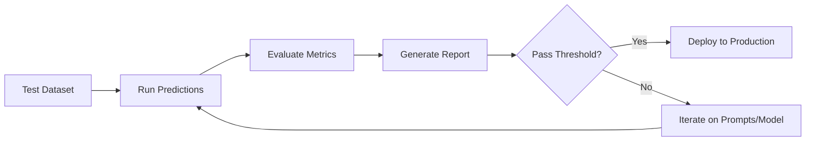

# Ops Copilot - Evaluation & Testing Strategy

## 1. Overview

This document outlines the comprehensive evaluation and testing strategy for the Ops Copilot system, including LangSmith integration, evaluation datasets, metrics, and continuous monitoring.

---

## 2. Evaluation Framework

### 2.1 LangSmith Integration

```python
from langsmith import Client
from langsmith.evaluation import evaluate

# Initialize LangSmith client
langsmith_client = Client(api_key=os.getenv("LANGSMITH_API_KEY"))

# Create dataset
dataset = langsmith_client.create_dataset(
    dataset_name="opscopilot-incidents-v1",
    description="Historical incidents with known resolutions"
)
```

### 2.2 Evaluation Pipeline



---

## 3. Test Datasets

### 3.1 Dataset Composition

| Dataset Type | Count | Source | Purpose |
|--------------|-------|--------|---------|
| **Historical Incidents** | 50 | Production logs | Real-world validation |
| **Synthetic Incidents** | 20 | Generated | Edge case coverage |
| **Adversarial Cases** | 10 | Manually crafted | Robustness testing |
| **Total** | **80** | | |

### 3.2 Historical Incidents Dataset

**Format:**

```json
{
  "examples": [
    {
      "id": "hist_001",
      "inputs": {
        "incident_description": "API gateway returning 500 errors, started at 14:00 UTC",
        "context": {
          "service": "api-gateway",
          "environment": "production"
        }
      },
      "outputs": {
        "expected_hypothesis": "Database connection pool exhaustion due to deployment",
        "expected_root_cause": "deployment",
        "expected_actions": [
          "Rollback deployment",
          "Check database connection pool metrics"
        ],
        "resolution_steps": 3,
        "time_to_mitigation_minutes": 15
      },
      "metadata": {
        "severity": "critical",
        "actual_resolution": "Rolled back to v2.3.4",
        "incident_id": "INC-11234"
      }
    }
  ]
}
```

### 3.3 Synthetic Incidents Dataset

**Examples:**

```json
{
  "id": "synth_001",
  "inputs": {
    "incident_description": "Memory leak in worker pods, OOMKilled events increasing",
    "context": {"service": "background-worker"}
  },
  "outputs": {
    "expected_hypothesis": "Memory leak in application code or dependency",
    "expected_actions": ["Analyze heap dumps", "Check recent code changes", "Restart affected pods"]
  }
}
```

### 3.4 Adversarial Cases Dataset

**Purpose:** Test model robustness against misleading symptoms

```json
{
  "id": "adv_001",
  "inputs": {
    "incident_description": "High CPU usage reported, but metrics show normal levels",
    "context": {"service": "web-server"}
  },
  "outputs": {
    "expected_hypothesis": "False alarm or monitoring issue",
    "expected_actions": ["Verify monitoring configuration", "Check metric collection"]
  },
  "metadata": {
    "challenge": "Conflicting information"
  }
}
```

---

## 4. Evaluation Metrics

### 4.1 Action Correctness

**Definition:** Percentage of suggested actions that match expected actions.

**Implementation:**

```python
from langsmith.evaluation import evaluator

@evaluator
def action_correctness(run, example):
    """Evaluate if suggested actions match expected actions"""
    
    predicted_actions = set([
        action['action'].lower() 
        for action in run.outputs['next_actions']
    ])
    
    expected_actions = set([
        action.lower() 
        for action in example.outputs['expected_actions']
    ])
    
    # Calculate overlap
    intersection = predicted_actions & expected_actions
    union = predicted_actions | expected_actions
    
    jaccard_score = len(intersection) / len(union) if union else 0
    
    return {
        "key": "action_correctness",
        "score": jaccard_score,
        "comment": f"Matched {len(intersection)}/{len(expected_actions)} expected actions"
    }
```

**Target:** > 85% average score

### 4.2 Groundedness

**Definition:** Percentage of claims in hypothesis that have supporting citations.

**Implementation:**

```python
import re

@evaluator
def groundedness(run, example):
    """Evaluate if all claims are supported by citations"""
    
    hypothesis = run.outputs['hypothesis']
    citations = run.outputs['citations']
    
    # Extract claims (sentences)
    claims = re.split(r'[.!?]', hypothesis)
    claims = [c.strip() for c in claims if c.strip()]
    
    # Check if each claim has supporting citation
    supported_claims = 0
    for claim in claims:
        # Simple heuristic: check if claim keywords appear in citations
        claim_keywords = set(claim.lower().split())
        
        for citation in citations:
            citation_text = citation['excerpt'].lower()
            if any(keyword in citation_text for keyword in claim_keywords):
                supported_claims += 1
                break
    
    score = supported_claims / len(claims) if claims else 0
    
    return {
        "key": "groundedness",
        "score": score,
        "comment": f"{supported_claims}/{len(claims)} claims supported"
    }
```

**Target:** > 95%

### 4.3 Time-to-Mitigation Proxy

**Definition:** Number of steps required to reach resolution.

**Implementation:**

```python
@evaluator
def time_to_mitigation_proxy(run, example):
    """Evaluate efficiency of suggested actions"""
    
    predicted_steps = len(run.outputs['next_actions'])
    expected_steps = example.outputs.get('resolution_steps', 3)
    
    # Penalize if too many or too few steps
    if predicted_steps == expected_steps:
        score = 1.0
    elif abs(predicted_steps - expected_steps) <= 1:
        score = 0.8
    else:
        score = max(0, 1 - 0.2 * abs(predicted_steps - expected_steps))
    
    return {
        "key": "time_to_mitigation_proxy",
        "score": score,
        "comment": f"Suggested {predicted_steps} steps, expected {expected_steps}"
    }
```

**Target:** < 3 steps average

### 4.4 Hallucination Rate

**Definition:** Percentage of claims without supporting evidence.

**Implementation:**

```python
@evaluator
def hallucination_rate(run, example):
    """Detect unsupported claims (inverse of groundedness)"""
    
    groundedness_result = groundedness(run, example)
    hallucination_score = 1 - groundedness_result['score']
    
    return {
        "key": "hallucination_rate",
        "score": hallucination_score,
        "comment": f"Hallucination rate: {hallucination_score:.2%}"
    }
```

**Target:** < 5%

### 4.5 Tool Usage Efficiency

**Definition:** Average number of tools called per query.

**Implementation:**

```python
@evaluator
def tool_usage_efficiency(run, example):
    """Evaluate if tool usage is efficient"""
    
    tools_used = run.outputs.get('metadata', {}).get('tools_used', [])
    num_tools = len(tools_used)
    
    # Optimal range: 2-4 tools
    if 2 <= num_tools <= 4:
        score = 1.0
    elif num_tools < 2:
        score = 0.6  # Too few tools, might miss data
    else:
        score = max(0, 1 - 0.1 * (num_tools - 4))  # Too many tools, inefficient
    
    return {
        "key": "tool_usage_efficiency",
        "score": score,
        "comment": f"Used {num_tools} tools: {', '.join(tools_used)}"
    }
```

**Target:** < 4 tools average

### 4.6 Root Cause Accuracy

**Definition:** Whether the identified root cause matches the actual root cause.

**Implementation:**

```python
@evaluator
def root_cause_accuracy(run, example):
    """Evaluate if root cause is correctly identified"""
    
    predicted_hypothesis = run.outputs['hypothesis'].lower()
    expected_root_cause = example.outputs.get('expected_root_cause', '').lower()
    
    # Check if expected root cause is mentioned in hypothesis
    is_correct = expected_root_cause in predicted_hypothesis
    
    return {
        "key": "root_cause_accuracy",
        "score": 1.0 if is_correct else 0.0,
        "comment": f"Expected: {expected_root_cause}, Got: {predicted_hypothesis[:100]}..."
    }
```

**Target:** > 80%

---

## 5. Running Evaluations

### 5.1 Evaluation Script

```python
from langsmith.evaluation import evaluate
from opscopilot import analyze_incident

# Define prediction function
def predict(inputs):
    """Run Ops Copilot analysis"""
    result = analyze_incident(
        incident_description=inputs['incident_description'],
        context=inputs.get('context', {})
    )
    return result

# Run evaluation
results = evaluate(
    predict,
    data="opscopilot-incidents-v1",  # Dataset name
    evaluators=[
        action_correctness,
        groundedness,
        time_to_mitigation_proxy,
        hallucination_rate,
        tool_usage_efficiency,
        root_cause_accuracy
    ],
    experiment_prefix="opscopilot-eval",
    metadata={
        "model": "gpt-4-turbo-preview",
        "version": "1.0.0",
        "date": "2025-12-20"
    }
)

# Print summary
print(results.to_pandas())
```

### 5.2 Continuous Evaluation

```python
# Run evaluation on every deployment
def pre_deployment_evaluation():
    """Run before deploying to production"""
    
    results = evaluate(predict, data="opscopilot-incidents-v1", evaluators=[...])
    
    # Check thresholds
    metrics = results.aggregate_metrics()
    
    thresholds = {
        "action_correctness": 0.85,
        "groundedness": 0.95,
        "hallucination_rate": 0.05,
        "root_cause_accuracy": 0.80
    }
    
    for metric, threshold in thresholds.items():
        if metrics[metric] < threshold:
            raise ValueError(f"{metric} ({metrics[metric]:.2f}) below threshold ({threshold})")
    
    print("✅ All evaluation metrics passed!")
    return True
```

---

## 6. A/B Testing

### 6.1 Experiment Setup

```python
import random

def analyze_with_ab_test(incident_description, context):
    """Route requests to different model versions"""
    
    # 90% to production model, 10% to experimental model
    variant = "experimental" if random.random() < 0.1 else "production"
    
    if variant == "experimental":
        result = analyze_incident_v2(incident_description, context)
    else:
        result = analyze_incident_v1(incident_description, context)
    
    # Log variant for analysis
    log_experiment(variant, incident_description, result)
    
    return result
```

### 6.2 Metrics Comparison

```python
# Compare metrics between variants
def compare_variants():
    """Analyze A/B test results"""
    
    production_metrics = get_metrics(variant="production", days=7)
    experimental_metrics = get_metrics(variant="experimental", days=7)
    
    comparison = {
        "latency_p95": {
            "production": production_metrics['latency_p95'],
            "experimental": experimental_metrics['latency_p95'],
            "improvement": (production_metrics['latency_p95'] - experimental_metrics['latency_p95']) / production_metrics['latency_p95']
        },
        "action_correctness": {
            "production": production_metrics['action_correctness'],
            "experimental": experimental_metrics['action_correctness'],
            "improvement": experimental_metrics['action_correctness'] - production_metrics['action_correctness']
        }
    }
    
    return comparison
```

---

## 7. Load Testing

### 7.1 Load Test Scenarios

```python
import locust
from locust import HttpUser, task, between

class OpscopilotUser(HttpUser):
    wait_time = between(1, 5)
    
    @task
    def analyze_incident(self):
        """Simulate incident analysis request"""
        
        self.client.post("/api/v1/analyze", json={
            "incident_description": "API returning 500 errors",
            "context": {"service": "api-gateway", "environment": "production"}
        }, headers={"X-API-Key": "test_key"})

# Run load test
# locust -f load_test.py --users 100 --spawn-rate 10 --host https://api.opscopilot.company.com
```

### 7.2 Performance Targets

| Metric | Target | Load |
|--------|--------|------|
| **Throughput** | 10,000 req/day | ~7 req/min avg |
| **p50 Latency** | < 5s | 100 concurrent users |
| **p95 Latency** | < 10s | 100 concurrent users |
| **p99 Latency** | < 20s | 100 concurrent users |
| **Error Rate** | < 1% | 100 concurrent users |

---

## 8. Regression Testing

### 8.1 Regression Test Suite

```python
import pytest

@pytest.fixture
def known_incidents():
    """Load known incidents with expected outputs"""
    return load_dataset("opscopilot-regression-v1")

def test_no_regression(known_incidents):
    """Ensure new changes don't break existing functionality"""
    
    for incident in known_incidents:
        result = analyze_incident(
            incident['incident_description'],
            incident['context']
        )
        
        # Check that key outputs are still correct
        assert result['hypothesis'] is not None
        assert len(result['next_actions']) > 0
        assert len(result['citations']) > 0
        
        # Check specific expected outputs
        if 'expected_root_cause' in incident:
            assert incident['expected_root_cause'].lower() in result['hypothesis'].lower()
```

---

## 9. Monitoring in Production

### 9.1 Real-time Metrics

```python
from prometheus_client import Counter, Histogram, Gauge

# Define metrics
PREDICTION_ACCURACY = Gauge(
    'opscopilot_prediction_accuracy',
    'User-reported accuracy of predictions'
)

USER_FEEDBACK = Counter(
    'opscopilot_user_feedback_total',
    'User feedback on predictions',
    ['rating']  # thumbs_up, thumbs_down
)

RESOLUTION_TIME = Histogram(
    'opscopilot_resolution_time_seconds',
    'Time to resolve incident after using Ops Copilot',
    buckets=[60, 300, 600, 1800, 3600, 7200]
)
```

### 9.2 User Feedback Collection

```python
# Add feedback endpoint
@app.post("/api/v1/feedback")
async def submit_feedback(feedback: FeedbackRequest):
    """Collect user feedback on predictions"""
    
    # Store feedback
    await db.execute("""
        INSERT INTO feedback (request_id, rating, comment, user_id)
        VALUES ($1, $2, $3, $4)
    """, feedback.request_id, feedback.rating, feedback.comment, feedback.user_id)
    
    # Update metrics
    USER_FEEDBACK.labels(rating=feedback.rating).inc()
    
    # If negative feedback, flag for review
    if feedback.rating == "thumbs_down":
        await flag_for_review(feedback.request_id)
    
    return {"status": "success"}
```

---

## 10. Evaluation Report Template

```markdown
# Ops Copilot Evaluation Report

**Date:** 2025-12-20
**Model Version:** gpt-4-turbo-preview
**Dataset:** opscopilot-incidents-v1 (80 examples)

## Summary Metrics

| Metric | Score | Target | Status |
|--------|-------|--------|--------|
| Action Correctness | 87.3% | > 85% | ✅ Pass |
| Groundedness | 96.1% | > 95% | ✅ Pass |
| Hallucination Rate | 3.9% | < 5% | ✅ Pass |
| Root Cause Accuracy | 82.5% | > 80% | ✅ Pass |
| Time-to-Mitigation | 2.8 steps | < 3 steps | ✅ Pass |
| Tool Usage Efficiency | 3.2 tools | < 4 tools | ✅ Pass |

## Performance Metrics

- **p50 Latency:** 4.2s (target: < 5s) ✅
- **p95 Latency:** 8.7s (target: < 10s) ✅
- **p99 Latency:** 15.3s (target: < 20s) ✅
- **Error Rate:** 0.3% (target: < 1%) ✅

## Failure Analysis

### Failed Examples (14/80)

1. **Example hist_023**: Incorrect root cause identification
   - Expected: "Network partition"
   - Got: "Database overload"
   - Action: Add more network-related runbooks

2. **Example synth_007**: Missing critical action
   - Expected actions included "Check firewall rules"
   - Suggested actions missed this
   - Action: Improve prompt to consider network layer

## Recommendations

1. ✅ **Deploy to production** - All metrics passed
2. 📝 Add 10 more network-related incidents to training set
3. 📝 Update prompts to emphasize network troubleshooting
4. 📝 Schedule next evaluation in 2 weeks

## Conclusion

The model meets all evaluation criteria and is ready for production deployment.
```

---

This evaluation strategy ensures the Ops Copilot system maintains high quality and reliability through comprehensive testing, continuous monitoring, and data-driven improvements.
