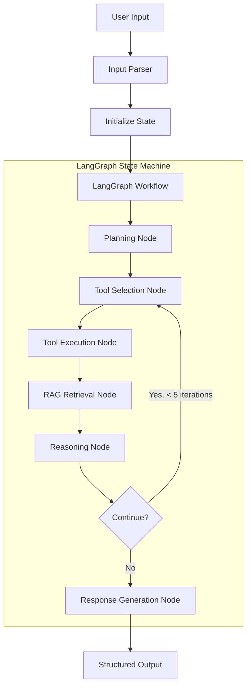

# LangChain & LangGraph Architecture for Ops Copilot

## Overview

This document explains how LangChain and LangGraph are used in the Ops Copilot system to orchestrate the AI-powered incident response workflow.

---

## 1. Architecture Overview

### Why LangGraph?

**LangGraph** is chosen over basic LangChain for several key reasons:

1. **State Management**: Built-in state persistence across agent iterations
2. **Cycle Detection**: Prevents infinite loops with configurable iteration limits
3. **Conditional Routing**: Dynamic tool selection based on context
4. **Checkpointing**: Ability to save and resume agent state
5. **Observability**: Better debugging and tracing capabilities

### High-Level Flow



---

## 2. State Schema

### LangGraph State Definition

```python
from typing import TypedDict, List, Dict, Any, Optional
from langgraph.graph import StateGraph

class AgentState(TypedDict):
    """
    State schema for the Ops Copilot agent.
    This state is passed between all nodes in the graph.
    """
    # Input
    incident_description: str
    context: Dict[str, str]
    correlation_id: str
    
    # Intermediate state
    iteration_count: int
    tools_to_execute: List[str]
    tool_results: Dict[str, Any]
    runbooks: List[Dict[str, Any]]
    evidence: List[Dict[str, Any]]
    timeline: List[Dict[str, Any]]
    
    # LLM interaction
    messages: List[Dict[str, str]]  # Chat history
    current_hypothesis: Optional[str]
    confidence: Optional[float]
    
    # Output
    final_response: Optional[Dict[str, Any]]
    error: Optional[str]
    
    # Metadata
    start_time: float
    tools_used: List[str]
```

---

## 3. Graph Nodes

### Node 1: Input Parser

```python
from langchain.schema import HumanMessage, SystemMessage

def parse_input_node(state: AgentState) -> AgentState:
    """
    Parse and validate user input.
    First node in the graph.
    """
    # Initialize state
    state["iteration_count"] = 0
    state["tools_used"] = []
    state["tool_results"] = {}
    state["evidence"] = []
    state["timeline"] = []
    state["start_time"] = time.time()
    
    # Create initial message
    state["messages"] = [
        SystemMessage(content=SYSTEM_PROMPT),
        HumanMessage(content=f"""
        Analyze this incident:
        
        Description: {state['incident_description']}
        Service: {state['context'].get('service', 'unknown')}
        Environment: {state['context'].get('environment', 'production')}
        
        What tools should we use to investigate?
        """)
    ]
    
    return state
```

### Node 2: Planning & Tool Selection

```python
from langchain.chat_models import ChatOpenAI
from langchain.output_parsers import PydanticOutputParser
from pydantic import BaseModel, Field

class ToolPlan(BaseModel):
    """Schema for tool selection output"""
    tools: List[str] = Field(description="List of tools to execute")
    reasoning: str = Field(description="Why these tools were selected")

def planning_node(state: AgentState) -> AgentState:
    """
    Decide which tools to execute based on incident description.
    Uses LLM to intelligently select tools.
    """
    llm = ChatOpenAI(model="gpt-4-turbo-preview", temperature=0.1)
    parser = PydanticOutputParser(pydantic_object=ToolPlan)
    
    # Create planning prompt
    planning_prompt = f"""
    Available tools:
    1. log_search - Search application logs
    2. metrics_query - Query time-series metrics
    3. deploy_history - Get recent deployments
    4. runbook_search - Search runbook corpus
    
    Based on the incident description, which tools should we use?
    
    {parser.get_format_instructions()}
    """
    
    state["messages"].append(HumanMessage(content=planning_prompt))
    
    # Get LLM response
    response = llm(state["messages"])
    plan = parser.parse(response.content)
    
    # Update state
    state["tools_to_execute"] = plan.tools
    state["messages"].append(response)
    
    return state
```

### Node 3: Tool Execution

```python
import asyncio
from typing import Callable, Dict

class ToolRegistry:
    """Registry of available tools"""
    
    def __init__(self):
        self.tools: Dict[str, Callable] = {
            "log_search": self.log_search_tool,
            "metrics_query": self.metrics_query_tool,
            "deploy_history": self.deploy_history_tool,
            "runbook_search": self.runbook_search_tool,
        }
    
    async def log_search_tool(self, state: AgentState) -> Dict[str, Any]:
        """Execute log search"""
        # Implementation from DATAFLOW.md
        query = f"service:{state['context']['service']} AND error"
        # ... call Elasticsearch
        return {"logs": [...], "error_pattern": "..."}
    
    async def metrics_query_tool(self, state: AgentState) -> Dict[str, Any]:
        """Execute metrics query"""
        # Implementation from DATAFLOW.md
        # ... call Prometheus
        return {"data_points": [...], "spike_detected": True}
    
    async def deploy_history_tool(self, state: AgentState) -> Dict[str, Any]:
        """Get deployment history"""
        # ... call Deploy API
        return {"deployments": [...], "correlation": {...}}
    
    async def runbook_search_tool(self, state: AgentState) -> Dict[str, Any]:
        """Search runbooks using RAG"""
        # ... hybrid retrieval
        return {"runbooks": [...]}

async def tool_execution_node(state: AgentState) -> AgentState:
    """
    Execute selected tools in parallel.
    """
    registry = ToolRegistry()
    
    # Execute tools in parallel
    tasks = [
        registry.tools[tool_name](state)
        for tool_name in state["tools_to_execute"]
    ]
    
    results = await asyncio.gather(*tasks, return_exceptions=True)
    
    # Store results
    for tool_name, result in zip(state["tools_to_execute"], results):
        if isinstance(result, Exception):
            state["tool_results"][tool_name] = {"success": False, "error": str(result)}
        else:
            state["tool_results"][tool_name] = {"success": True, "data": result}
        
        state["tools_used"].append(tool_name)
    
    return state
```

### Node 4: RAG Retrieval

```python
from langchain.embeddings import OpenAIEmbeddings
from langchain.vectorstores import Pinecone
from langchain.retrievers import EnsembleRetriever
from langchain.retrievers import BM25Retriever

def rag_retrieval_node(state: AgentState) -> AgentState:
    """
    Hybrid RAG retrieval: Vector + Keyword search.
    """
    # Initialize embeddings
    embeddings = OpenAIEmbeddings(model="text-embedding-3-large")
    
    # Vector retriever (Pinecone)
    vector_store = Pinecone.from_existing_index(
        index_name="runbooks",
        embedding=embeddings
    )
    vector_retriever = vector_store.as_retriever(
        search_kwargs={"k": 20, "filter": {"service": state["context"]["service"]}}
    )
    
    # Keyword retriever (BM25 on Elasticsearch)
    keyword_retriever = BM25Retriever.from_texts(
        texts=get_runbook_texts(),  # From Elasticsearch
        k=20
    )
    
    # Ensemble retriever (Reciprocal Rank Fusion)
    ensemble_retriever = EnsembleRetriever(
        retrievers=[vector_retriever, keyword_retriever],
        weights=[0.5, 0.5]
    )
    
    # Retrieve documents
    docs = ensemble_retriever.get_relevant_documents(state["incident_description"])
    
    # Rerank using cross-encoder (optional)
    reranked_docs = rerank_documents(state["incident_description"], docs[:40])
    
    # Store top 5
    state["runbooks"] = [
        {
            "id": doc.metadata["id"],
            "title": doc.metadata["title"],
            "content": doc.page_content,
            "score": doc.metadata.get("score", 0.0)
        }
        for doc in reranked_docs[:5]
    ]
    
    return state
```

### Node 5: Evidence Aggregation

```python
def evidence_aggregation_node(state: AgentState) -> AgentState:
    """
    Aggregate evidence from tool results and runbooks.
    """
    evidence = []
    timeline = []
    
    # Extract evidence from logs
    if "log_search" in state["tool_results"]:
        log_data = state["tool_results"]["log_search"]["data"]
        evidence.append({
            "source": "logs",
            "finding": log_data.get("error_pattern", ""),
            "count": len(log_data.get("logs", []))
        })
    
    # Extract evidence from metrics
    if "metrics_query" in state["tool_results"]:
        metrics_data = state["tool_results"]["metrics_query"]["data"]
        if metrics_data.get("spike_detected"):
            evidence.append({
                "source": "metrics",
                "finding": f"Error rate spike: {metrics_data['metadata']['peak']} req/s",
                "baseline": metrics_data["metadata"]["baseline"]
            })
            
            # Add to timeline
            timeline.append({
                "timestamp": metrics_data["metadata"]["spike_start"],
                "type": "anomaly",
                "description": "Error rate spike detected"
            })
    
    # Extract evidence from deployments
    if "deploy_history" in state["tool_results"]:
        deploy_data = state["tool_results"]["deploy_history"]["data"]
        if deploy_data.get("correlation", {}).get("likely_related"):
            evidence.append({
                "source": "deployment",
                "finding": f"Recent deployment: {deploy_data['deployments'][0]['version']}",
                "correlation": deploy_data["correlation"]
            })
            
            # Add to timeline
            timeline.append({
                "timestamp": deploy_data["deployments"][0]["timestamp"],
                "type": "deployment",
                "description": f"Deployed {deploy_data['deployments'][0]['version']}"
            })
    
    # Sort timeline chronologically
    state["evidence"] = evidence
    state["timeline"] = sorted(timeline, key=lambda x: x["timestamp"])
    
    return state
```

### Node 6: Reasoning & Hypothesis Generation

```python
from langchain.prompts import ChatPromptTemplate
from langchain.output_parsers import StructuredOutputParser, ResponseSchema

def reasoning_node(state: AgentState) -> AgentState:
    """
    Generate hypothesis and next actions using LLM.
    """
    llm = ChatOpenAI(model="gpt-4-turbo-preview", temperature=0.1)
    
    # Define output schema
    response_schemas = [
        ResponseSchema(name="hypothesis", description="Root cause hypothesis"),
        ResponseSchema(name="confidence", description="Confidence score 0-1"),
        ResponseSchema(name="reasoning", description="Reasoning behind hypothesis"),
        ResponseSchema(name="next_actions", description="List of next actions"),
    ]
    
    parser = StructuredOutputParser.from_response_schemas(response_schemas)
    
    # Create reasoning prompt
    prompt = ChatPromptTemplate.from_messages([
        ("system", SYSTEM_PROMPT),
        ("human", """
        Analyze the following evidence and form a hypothesis:
        
        INCIDENT: {incident_description}
        
        EVIDENCE:
        {evidence}
        
        TIMELINE:
        {timeline}
        
        RUNBOOKS:
        {runbooks}
        
        {format_instructions}
        """)
    ])
    
    # Format evidence
    evidence_str = "\n".join([
        f"- [{e['source']}] {e['finding']}"
        for e in state["evidence"]
    ])
    
    timeline_str = "\n".join([
        f"- {t['timestamp']}: {t['description']}"
        for t in state["timeline"]
    ])
    
    runbooks_str = "\n".join([
        f"[{i+1}] {r['title']} (score: {r['score']:.2f})\n   {r['content'][:200]}..."
        for i, r in enumerate(state["runbooks"])
    ])
    
    # Generate response
    chain = prompt | llm | parser
    
    result = chain.invoke({
        "incident_description": state["incident_description"],
        "evidence": evidence_str,
        "timeline": timeline_str,
        "runbooks": runbooks_str,
        "format_instructions": parser.get_format_instructions()
    })
    
    # Update state
    state["current_hypothesis"] = result["hypothesis"]
    state["confidence"] = float(result["confidence"])
    
    return state
```

### Node 7: Decision Node (Conditional Routing)

```python
def should_continue(state: AgentState) -> str:
    """
    Decide whether to continue iteration or generate final response.
    
    Returns:
        "continue" - Execute more tools
        "generate" - Generate final response
    """
    # Check iteration limit
    if state["iteration_count"] >= 5:
        return "generate"
    
    # Check if we have enough confidence
    if state.get("confidence", 0) >= 0.8:
        return "generate"
    
    # Check if we have sufficient evidence
    if len(state["evidence"]) >= 3:
        return "generate"
    
    # Check timeout
    elapsed = time.time() - state["start_time"]
    if elapsed > 25:  # 25s to leave buffer for response generation
        return "generate"
    
    # Continue if we need more data
    return "continue"
```

### Node 8: Response Generation

```python
from pydantic import BaseModel, Field

class NextAction(BaseModel):
    action: str
    priority: str
    estimated_time: str
    rationale: str

class Command(BaseModel):
    description: str
    command: str
    safe_to_run: bool

class Citation(BaseModel):
    source: str
    reference: str
    excerpt: str
    timestamp: Optional[str]

class FinalResponse(BaseModel):
    hypothesis: str
    confidence: float
    next_actions: List[NextAction]
    commands: List[Command]
    citations: List[Citation]

def response_generation_node(state: AgentState) -> AgentState:
    """
    Generate final structured response.
    """
    llm = ChatOpenAI(model="gpt-4-turbo-preview", temperature=0.1)
    
    # Use structured output
    structured_llm = llm.with_structured_output(FinalResponse)
    
    prompt = f"""
    Based on all the evidence gathered, provide a complete incident analysis:
    
    HYPOTHESIS: {state['current_hypothesis']}
    CONFIDENCE: {state['confidence']}
    
    EVIDENCE:
    {format_evidence(state['evidence'])}
    
    TIMELINE:
    {format_timeline(state['timeline'])}
    
    Provide:
    1. Refined hypothesis
    2. 3-5 prioritized next actions
    3. Specific commands to run (if applicable)
    4. Citations for all claims
    """
    
    response = structured_llm.invoke(prompt)
    
    # Store final response
    state["final_response"] = response.dict()
    
    return state
```

---

## 4. Building the Graph

```python
from langgraph.graph import StateGraph, END
from langgraph.checkpoint.sqlite import SqliteSaver

def create_ops_copilot_graph():
    """
    Create the LangGraph workflow for Ops Copilot.
    """
    # Initialize graph with state schema
    workflow = StateGraph(AgentState)
    
    # Add nodes
    workflow.add_node("parse_input", parse_input_node)
    workflow.add_node("planning", planning_node)
    workflow.add_node("tool_execution", tool_execution_node)
    workflow.add_node("rag_retrieval", rag_retrieval_node)
    workflow.add_node("evidence_aggregation", evidence_aggregation_node)
    workflow.add_node("reasoning", reasoning_node)
    workflow.add_node("response_generation", response_generation_node)
    
    # Define edges
    workflow.set_entry_point("parse_input")
    
    workflow.add_edge("parse_input", "planning")
    workflow.add_edge("planning", "tool_execution")
    workflow.add_edge("tool_execution", "rag_retrieval")
    workflow.add_edge("rag_retrieval", "evidence_aggregation")
    workflow.add_edge("evidence_aggregation", "reasoning")
    
    # Conditional edge: continue or generate response
    workflow.add_conditional_edges(
        "reasoning",
        should_continue,
        {
            "continue": "planning",  # Loop back for more tools
            "generate": "response_generation"
        }
    )
    
    workflow.add_edge("response_generation", END)
    
    # Add checkpointing for state persistence
    memory = SqliteSaver.from_conn_string(":memory:")
    
    # Compile graph
    app = workflow.compile(checkpointer=memory)
    
    return app
```

---

## 5. Execution Flow

### Complete Input Journey

```python
async def analyze_incident(
    incident_description: str,
    context: Dict[str, str]
) -> Dict[str, Any]:
    """
    Main entry point for incident analysis.
    Demonstrates complete input journey through LangGraph.
    """
    # Create graph
    app = create_ops_copilot_graph()
    
    # Initialize state
    initial_state = {
        "incident_description": incident_description,
        "context": context,
        "correlation_id": generate_correlation_id(),
    }
    
    # Execute graph
    config = {"configurable": {"thread_id": initial_state["correlation_id"]}}
    
    # Stream execution for observability
    async for event in app.astream(initial_state, config):
        node_name = list(event.keys())[0]
        node_output = event[node_name]
        
        print(f"[{node_name}] Iteration: {node_output.get('iteration_count', 0)}")
        
        # Log intermediate state
        if node_name == "planning":
            print(f"  Tools selected: {node_output['tools_to_execute']}")
        elif node_name == "reasoning":
            print(f"  Hypothesis: {node_output['current_hypothesis'][:100]}...")
            print(f"  Confidence: {node_output['confidence']}")
    
    # Get final state
    final_state = await app.aget_state(config)
    
    return final_state.values["final_response"]
```

### Example Execution Trace

```
[parse_input] Iteration: 0
  Initialized state with correlation_id: req_abc123

[planning] Iteration: 0
  Tools selected: ['log_search', 'metrics_query', 'deploy_history', 'runbook_search']

[tool_execution] Iteration: 0
  Executing 4 tools in parallel...
  ✓ log_search completed (1.2s)
  ✓ metrics_query completed (0.9s)
  ✓ deploy_history completed (0.5s)
  ✓ runbook_search completed (2.8s)

[rag_retrieval] Iteration: 0
  Retrieved 20 vector results, 20 keyword results
  Reranked to top 5 runbooks

[evidence_aggregation] Iteration: 0
  Aggregated 3 evidence sources
  Built timeline with 2 events

[reasoning] Iteration: 0
  Hypothesis: Database driver incompatibility from v2.3.5 deployment...
  Confidence: 0.85

[Decision: should_continue] -> generate (confidence >= 0.8)

[response_generation] Iteration: 0
  Generated final response with 4 next actions, 3 commands, 4 citations
```

---

## 6. Advanced Features

### 6.1 Human-in-the-Loop

```python
from langgraph.prebuilt import ToolExecutor

def create_graph_with_human_approval():
    """
    Add human approval step before executing certain tools.
    """
    workflow = StateGraph(AgentState)
    
    # ... add nodes as before
    
    # Add interrupt before tool execution
    workflow.add_node("human_approval", lambda state: state)
    
    workflow.add_edge("planning", "human_approval")
    workflow.add_edge("human_approval", "tool_execution")
    
    # Compile with interrupt
    app = workflow.compile(
        checkpointer=memory,
        interrupt_before=["human_approval"]
    )
    
    return app

# Usage
app = create_graph_with_human_approval()
state = app.invoke(initial_state, config)

# System pauses at human_approval
print(f"Tools to execute: {state['tools_to_execute']}")
approval = input("Approve? (y/n): ")

if approval == "y":
    # Resume execution
    final_state = app.invoke(None, config)
```

### 6.2 Streaming Responses

```python
async def stream_analysis(incident_description: str, context: Dict[str, str]):
    """
    Stream intermediate results to user.
    """
    app = create_ops_copilot_graph()
    
    initial_state = {
        "incident_description": incident_description,
        "context": context,
        "correlation_id": generate_correlation_id(),
    }
    
    async for event in app.astream(initial_state):
        node_name = list(event.keys())[0]
        node_output = event[node_name]
        
        # Stream updates to user
        yield {
            "node": node_name,
            "status": "processing",
            "data": {
                "iteration": node_output.get("iteration_count"),
                "tools_used": node_output.get("tools_used", []),
                "hypothesis": node_output.get("current_hypothesis"),
            }
        }
    
    # Final response
    yield {
        "node": "complete",
        "status": "done",
        "data": final_state.values["final_response"]
    }
```

### 6.3 Error Recovery

```python
def error_recovery_node(state: AgentState) -> AgentState:
    """
    Handle errors gracefully.
    """
    if state.get("error"):
        # Log error
        logger.error(f"Error in workflow: {state['error']}")
        
        # Attempt recovery
        if "tool_execution" in state["error"]:
            # Retry with fewer tools
            state["tools_to_execute"] = state["tools_to_execute"][:2]
            state["error"] = None
        else:
            # Generate degraded response
            state["final_response"] = {
                "hypothesis": "Unable to complete analysis due to errors",
                "confidence": 0.0,
                "next_actions": [{"action": "Manual investigation required"}],
                "error": state["error"]
            }
    
    return state
```

---

## 7. Observability & Debugging

### LangSmith Integration

```python
import os
from langsmith import Client

# Enable LangSmith tracing
os.environ["LANGCHAIN_TRACING_V2"] = "true"
os.environ["LANGCHAIN_PROJECT"] = "ops-copilot"
os.environ["LANGCHAIN_API_KEY"] = "your_api_key"

# All LangGraph executions are automatically traced
app = create_ops_copilot_graph()
result = app.invoke(initial_state)

# View trace at: https://smith.langchain.com
```

### Custom Callbacks

```python
from langchain.callbacks.base import BaseCallbackHandler

class OpscopilotCallback(BaseCallbackHandler):
    """Custom callback for monitoring"""
    
    def on_chain_start(self, serialized, inputs, **kwargs):
        print(f"Starting chain: {serialized.get('name')}")
    
    def on_chain_end(self, outputs, **kwargs):
        print(f"Chain completed")
    
    def on_tool_start(self, serialized, input_str, **kwargs):
        print(f"Executing tool: {serialized.get('name')}")
    
    def on_llm_start(self, serialized, prompts, **kwargs):
        print(f"LLM call started")

# Use callback
app.invoke(initial_state, config={"callbacks": [OpscopilotCallback()]})
```

---

This architecture provides a robust, observable, and maintainable implementation of the Ops Copilot agent using LangGraph!
