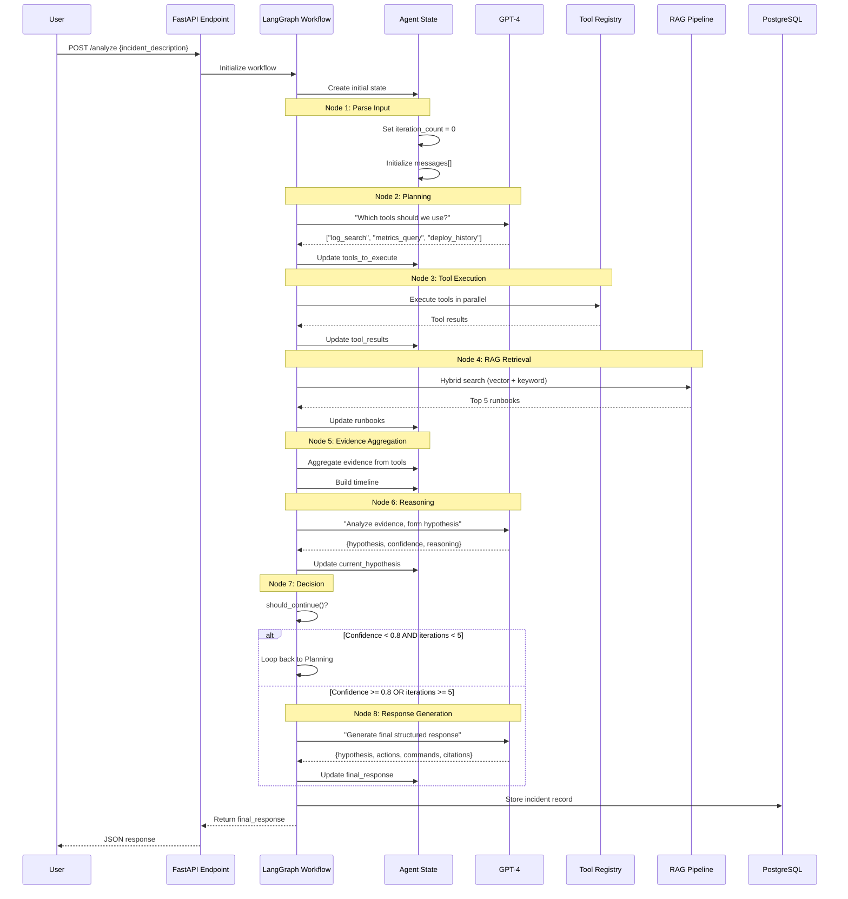

# LangChain & LangGraph Implementation Guide

## Complete Input Journey Visualization

This document provides a step-by-step walkthrough of how user input flows through the LangChain/LangGraph system in Ops Copilot.

---

## 1. Input Journey Overview



---

## 2. Detailed Step-by-Step Journey

### Step 1: User Input Arrives

**Input:**
```json
{
  "incident_description": "API gateway returning 500 errors since 2pm",
  "context": {
    "service": "api-gateway",
    "environment": "production"
  }
}
```

**What Happens:**
1. FastAPI endpoint receives POST request
2. Validates input schema using Pydantic
3. Generates correlation ID: `req_abc123`
4. Creates initial LangGraph state

**Code:**
```python
@app.post("/api/v1/analyze")
async def analyze_incident(request: AnalyzeRequest):
    # Initialize LangGraph workflow
    graph = create_ops_copilot_graph()
    
    # Create initial state
    initial_state = {
        "incident_description": request.incident_description,
        "context": request.context,
        "correlation_id": generate_correlation_id(),
    }
    
    # Execute graph
    result = await graph.ainvoke(initial_state)
    
    return result["final_response"]
```

---

### Step 2: Parse Input Node

**State Before:**
```python
{
    "incident_description": "API gateway returning 500 errors since 2pm",
    "context": {"service": "api-gateway", "environment": "production"},
    "correlation_id": "req_abc123"
}
```

**Node Processing:**
```python
def parse_input_node(state: AgentState) -> AgentState:
    # Initialize counters
    state["iteration_count"] = 0
    state["tools_used"] = []
    state["tool_results"] = {}
    state["start_time"] = time.time()
    
    # Create initial message for LLM
    state["messages"] = [
        SystemMessage(content="""
        You are an expert SRE assistant analyzing production incidents.
        Your goal is to identify root causes and suggest remediation steps.
        """),
        HumanMessage(content=f"""
        Incident: {state['incident_description']}
        Service: {state['context']['service']}
        Environment: {state['context']['environment']}
        
        What should we investigate first?
        """)
    ]
    
    return state
```

**State After:**
```python
{
    "incident_description": "API gateway returning 500 errors since 2pm",
    "context": {"service": "api-gateway", "environment": "production"},
    "correlation_id": "req_abc123",
    "iteration_count": 0,
    "tools_used": [],
    "tool_results": {},
    "start_time": 1703034470.123,
    "messages": [
        {"role": "system", "content": "You are an expert SRE..."},
        {"role": "user", "content": "Incident: API gateway..."}
    ]
}
```

---

### Step 3: Planning Node (LLM Call #1)

**LLM Input:**
```python
messages = [
    SystemMessage("You are an expert SRE assistant..."),
    HumanMessage("Incident: API gateway returning 500 errors..."),
    HumanMessage("""
    Available tools:
    1. log_search - Search application logs
    2. metrics_query - Query time-series metrics  
    3. deploy_history - Get recent deployments
    4. runbook_search - Search runbook corpus
    
    Which tools should we use? Respond in JSON format:
    {"tools": ["tool1", "tool2"], "reasoning": "..."}
    """)
]
```

**LLM Response:**
```json
{
    "tools": ["log_search", "metrics_query", "deploy_history", "runbook_search"],
    "reasoning": "500 errors suggest a service issue. We need logs to see error patterns, metrics to detect spikes, deployment history to check for recent changes, and runbooks for remediation steps."
}
```

**State Update:**
```python
state["tools_to_execute"] = ["log_search", "metrics_query", "deploy_history", "runbook_search"]
state["messages"].append(AIMessage(content="..."))
```

**Metrics:**
- LLM tokens: ~500 input, ~100 output
- Latency: ~1.2s
- Cost: ~$0.002

---

### Step 4: Tool Execution Node

**Parallel Execution:**

```python
async def tool_execution_node(state: AgentState) -> AgentState:
    registry = ToolRegistry()
    
    # Create tasks for parallel execution
    tasks = {
        "log_search": registry.log_search_tool(state),
        "metrics_query": registry.metrics_query_tool(state),
        "deploy_history": registry.deploy_history_tool(state),
        "runbook_search": registry.runbook_search_tool(state),
    }
    
    # Execute in parallel
    results = await asyncio.gather(*tasks.values(), return_exceptions=True)
    
    # Store results
    for tool_name, result in zip(tasks.keys(), results):
        state["tool_results"][tool_name] = result
        state["tools_used"].append(tool_name)
    
    return state
```

**Tool 1: Log Search**
```python
# Query Elasticsearch
query = {
    "query": {
        "bool": {
            "must": [
                {"match": {"message": "500"}},
                {"term": {"service": "api-gateway"}},
                {"range": {"timestamp": {"gte": "now-1h"}}}
            ]
        }
    },
    "size": 100
}

result = await elasticsearch.search(index="logs", body=query)

# Output
{
    "success": True,
    "data": {
        "logs": [
            {
                "timestamp": "2025-12-20T00:45:00Z",
                "message": "HTTP 500: Database connection timeout",
                "service": "api-gateway"
            },
            # ... 246 more logs
        ],
        "error_pattern": "Database connection timeout (78% of errors)"
    },
    "execution_time_ms": 1234
}
```

**Tool 2: Metrics Query**
```python
# Query Prometheus
promql = 'rate(http_requests_total{service="api-gateway", status="500"}[5m])'

result = await prometheus.query(promql)

# Output
{
    "success": True,
    "data": {
        "data_points": [
            {"timestamp": "2025-12-20T00:30:00Z", "value": 2.3},
            {"timestamp": "2025-12-20T00:35:00Z", "value": 15.7},
            {"timestamp": "2025-12-20T00:40:00Z", "value": 23.4}
        ],
        "metadata": {
            "spike_detected": True,
            "spike_start": "2025-12-20T00:35:00Z",
            "baseline": 2.1,
            "peak": 23.4
        }
    },
    "execution_time_ms": 876
}
```

**Tool 3: Deploy History**
```python
# Query Deploy API
result = await deploy_api.get_deployments(
    service="api-gateway",
    since="2025-12-19T18:00:00Z"
)

# Output
{
    "success": True,
    "data": {
        "deployments": [
            {
                "version": "v2.3.5",
                "timestamp": "2025-12-20T00:30:00Z",
                "author": "john.doe@company.com",
                "changes": ["Updated database driver", "Fixed memory leak"]
            }
        ],
        "correlation": {
            "incident_start": "2025-12-20T00:35:00Z",
            "deployment_time": "2025-12-20T00:30:00Z",
            "time_diff_minutes": 5,
            "likely_related": True
        }
    },
    "execution_time_ms": 543
}
```

**Tool 4: Runbook Search** (handled in RAG node)

**State After:**
```python
{
    # ... previous state
    "tool_results": {
        "log_search": {"success": True, "data": {...}},
        "metrics_query": {"success": True, "data": {...}},
        "deploy_history": {"success": True, "data": {...}}
    },
    "tools_used": ["log_search", "metrics_query", "deploy_history"]
}
```

**Metrics:**
- Total execution time: ~2.5s (parallel)
- Individual times: log(1.2s), metrics(0.9s), deploy(0.5s)

---

### Step 5: RAG Retrieval Node

**Hybrid Retrieval Process:**

```python
def rag_retrieval_node(state: AgentState) -> AgentState:
    query = state["incident_description"]
    
    # 1. Generate embedding
    embedding = openai.embeddings.create(
        model="text-embedding-3-large",
        input=query
    ).data[0].embedding
    
    # 2. Vector search (Pinecone)
    vector_results = pinecone_index.query(
        vector=embedding,
        top_k=20,
        filter={"service": state["context"]["service"]}
    )
    
    # 3. Keyword search (Elasticsearch)
    keyword_results = elasticsearch.search(
        index="runbooks",
        body={
            "query": {
                "multi_match": {
                    "query": query,
                    "fields": ["title^3", "content^1", "tags^2"]
                }
            },
            "size": 20
        }
    )
    
    # 4. Reciprocal Rank Fusion
    combined = reciprocal_rank_fusion(vector_results, keyword_results)
    
    # 5. Cross-encoder reranking
    reranked = cross_encoder_rerank(query, combined[:40])
    
    # 6. Take top 5
    state["runbooks"] = reranked[:5]
    
    return state
```

**Output:**
```python
state["runbooks"] = [
    {
        "id": "rb_001",
        "title": "Debugging 500 Errors in API Gateway",
        "content": "When API gateway returns 500 errors, check: 1. Database connection pool...",
        "score": 0.94,
        "url": "https://runbooks.company.com/rb_001"
    },
    {
        "id": "rb_042",
        "title": "Database Connection Timeouts",
        "content": "Common causes: 1. Pool exhaustion 2. Network issues...",
        "score": 0.91,
        "url": "https://runbooks.company.com/rb_042"
    },
    # ... 3 more runbooks
]
```

**Metrics:**
- Embedding generation: ~0.2s
- Vector search: ~0.3s
- Keyword search: ~0.4s
- Reranking: ~1.5s
- Total: ~2.5s

---

### Step 6: Evidence Aggregation Node

**Processing:**
```python
def evidence_aggregation_node(state: AgentState) -> AgentState:
    evidence = []
    timeline = []
    
    # From logs
    if "log_search" in state["tool_results"]:
        log_data = state["tool_results"]["log_search"]["data"]
        evidence.append({
            "source": "logs",
            "finding": log_data["error_pattern"],
            "count": len(log_data["logs"])
        })
    
    # From metrics
    if "metrics_query" in state["tool_results"]:
        metrics = state["tool_results"]["metrics_query"]["data"]
        if metrics["metadata"]["spike_detected"]:
            evidence.append({
                "source": "metrics",
                "finding": f"Error rate spike: {metrics['metadata']['peak']} req/s",
                "baseline": metrics["metadata"]["baseline"]
            })
            timeline.append({
                "timestamp": metrics["metadata"]["spike_start"],
                "type": "anomaly",
                "description": "Error rate spike detected"
            })
    
    # From deployments
    if "deploy_history" in state["tool_results"]:
        deploy = state["tool_results"]["deploy_history"]["data"]
        if deploy["correlation"]["likely_related"]:
            evidence.append({
                "source": "deployment",
                "finding": f"Deployment v{deploy['deployments'][0]['version']}",
                "details": deploy["deployments"][0]["changes"]
            })
            timeline.append({
                "timestamp": deploy["deployments"][0]["timestamp"],
                "type": "deployment",
                "description": f"Deployed {deploy['deployments'][0]['version']}"
            })
    
    state["evidence"] = evidence
    state["timeline"] = sorted(timeline, key=lambda x: x["timestamp"])
    
    return state
```

**Output:**
```python
state["evidence"] = [
    {
        "source": "logs",
        "finding": "Database connection timeout (78% of errors)",
        "count": 247
    },
    {
        "source": "metrics",
        "finding": "Error rate spike: 23.4 req/s",
        "baseline": 2.1
    },
    {
        "source": "deployment",
        "finding": "Deployment v2.3.5",
        "details": ["Updated database driver", "Fixed memory leak"]
    }
]

state["timeline"] = [
    {
        "timestamp": "2025-12-20T00:30:00Z",
        "type": "deployment",
        "description": "Deployed v2.3.5"
    },
    {
        "timestamp": "2025-12-20T00:35:00Z",
        "type": "anomaly",
        "description": "Error rate spike detected"
    }
]
```

---

### Step 7: Reasoning Node (LLM Call #2)

**LLM Input:**
```python
prompt = f"""
Analyze the following evidence and form a hypothesis:

INCIDENT: API gateway returning 500 errors since 2pm

EVIDENCE:
- [logs] Database connection timeout (78% of 247 errors)
- [metrics] Error rate spike: 23.4 req/s (baseline: 2.1)
- [deployment] Deployment v2.3.5 with changes: Updated database driver, Fixed memory leak

TIMELINE:
- 2025-12-20T00:30:00Z: Deployed v2.3.5
- 2025-12-20T00:35:00Z: Error rate spike detected

RUNBOOKS:
[1] "Debugging 500 Errors in API Gateway" (score: 0.94)
    - Check database connection pool settings
    - Verify database driver compatibility
    
[2] "Database Connection Timeouts" (score: 0.91)
    - Increase connection pool size
    - Check database load

Provide:
1. Root cause hypothesis
2. Confidence score (0-1)
3. Reasoning
"""
```

**LLM Response:**
```json
{
    "hypothesis": "The v2.3.5 deployment introduced a database driver incompatibility, causing connection pool exhaustion and timeouts. The updated driver likely has different connection handling behavior.",
    "confidence": 0.85,
    "reasoning": "Strong temporal correlation: deployment at 00:30, errors at 00:35 (5 min gap). Log pattern shows consistent 'Database connection timeout' (78% of failures). Recent change 'Updated database driver' is the likely culprit. Runbooks confirm driver compatibility is a common issue."
}
```

**State Update:**
```python
state["current_hypothesis"] = "The v2.3.5 deployment introduced..."
state["confidence"] = 0.85
state["iteration_count"] += 1
```

**Metrics:**
- LLM tokens: ~800 input, ~150 output
- Latency: ~2.1s
- Cost: ~$0.004

---

### Step 8: Decision Node

**Evaluation:**
```python
def should_continue(state: AgentState) -> str:
    # Check iteration limit
    if state["iteration_count"] >= 5:
        return "generate"  # Max iterations reached
    
    # Check confidence
    if state.get("confidence", 0) >= 0.8:
        return "generate"  # High confidence, proceed to response
    
    # Check evidence sufficiency
    if len(state["evidence"]) >= 3:
        return "generate"  # Enough evidence
    
    # Check timeout
    elapsed = time.time() - state["start_time"]
    if elapsed > 25:
        return "generate"  # Approaching timeout
    
    # Need more data
    return "continue"
```

**Decision:**
```python
# state["confidence"] = 0.85 >= 0.8
# Decision: "generate"
```

**Flow:**
- ✅ Confidence: 0.85 >= 0.8 → Proceed to response generation
- ⏭️ Skip looping back to planning

---

### Step 9: Response Generation Node (LLM Call #3)

**LLM Input:**
```python
prompt = f"""
Based on all evidence, provide a complete incident analysis:

HYPOTHESIS: {state['current_hypothesis']}
CONFIDENCE: {state['confidence']}

EVIDENCE:
{format_evidence(state['evidence'])}

TIMELINE:
{format_timeline(state['timeline'])}

RUNBOOKS:
{format_runbooks(state['runbooks'])}

Provide in JSON format:
{{
    "hypothesis": "refined hypothesis",
    "confidence": 0.85,
    "next_actions": [
        {{"action": "...", "priority": "high", "estimated_time": "5 minutes", "rationale": "..."}}
    ],
    "commands": [
        {{"description": "...", "command": "...", "safe_to_run": false}}
    ],
    "citations": [
        {{"source": "logs", "reference": "...", "excerpt": "...", "timestamp": "..."}}
    ]
}}
"""
```

**LLM Response:**
```json
{
    "hypothesis": "The v2.3.5 deployment introduced a database driver incompatibility, causing connection pool exhaustion and timeouts.",
    "confidence": 0.85,
    "next_actions": [
        {
            "action": "Rollback to v2.3.4 immediately to restore service",
            "priority": "high",
            "estimated_time": "5 minutes",
            "rationale": "Fastest path to mitigation given strong deployment correlation"
        },
        {
            "action": "Check database connection pool metrics",
            "priority": "high",
            "estimated_time": "2 minutes",
            "rationale": "Verify hypothesis about pool exhaustion"
        },
        {
            "action": "Review database driver changelog for breaking changes",
            "priority": "medium",
            "estimated_time": "15 minutes",
            "rationale": "Understand root cause for permanent fix"
        }
    ],
    "commands": [
        {
            "description": "Rollback API gateway to previous version",
            "command": "kubectl rollout undo deployment/api-gateway -n production",
            "safe_to_run": false
        },
        {
            "description": "Check current database connection pool metrics",
            "command": "curl 'http://prometheus:9090/api/v1/query?query=db_connection_pool_active{service=\"api-gateway\"}'",
            "safe_to_run": true
        }
    ],
    "citations": [
        {
            "source": "logs",
            "reference": "Elasticsearch query: status:500 AND service:api-gateway",
            "excerpt": "Database connection timeout (78% of 247 errors)",
            "timestamp": "2025-12-20T00:45:00Z"
        },
        {
            "source": "metrics",
            "reference": "Prometheus: http_requests_total{status=\"500\"}",
            "excerpt": "Error rate spike from 2.1 to 23.4 req/s",
            "timestamp": "2025-12-20T00:35:00Z"
        },
        {
            "source": "deployment",
            "reference": "Deploy API: /api/deployments/v2.3.5",
            "excerpt": "Changes: Updated database driver",
            "timestamp": "2025-12-20T00:30:00Z"
        },
        {
            "source": "runbook",
            "reference": "rb_001",
            "excerpt": "Verify database driver compatibility after updates",
            "timestamp": null
        }
    ]
}
```

**State Update:**
```python
state["final_response"] = {
    "hypothesis": "The v2.3.5 deployment...",
    "confidence": 0.85,
    "next_actions": [...],
    "commands": [...],
    "citations": [...]
}
```

**Metrics:**
- LLM tokens: ~1200 input, ~400 output
- Latency: ~3.2s
- Cost: ~$0.008

---

### Step 10: Store & Return

**Storage:**
```python
# Store in PostgreSQL
await db.execute("""
    INSERT INTO incidents (
        incident_id, description, hypothesis, status, 
        severity, affected_services, metadata
    ) VALUES ($1, $2, $3, $4, $5, $6, $7)
""", 
    "INC-12345",
    state["incident_description"],
    state["final_response"]["hypothesis"],
    "investigating",
    "high",
    ["api-gateway"],
    json.dumps(state["final_response"])
)

# Cache in Redis
await redis.setex(
    f"query:result:{cache_key}",
    3600,  # 1 hour TTL
    json.dumps(state["final_response"])
)
```

**Return to User:**
```json
{
    "request_id": "req_abc123",
    "timestamp": "2025-12-20T00:57:50Z",
    "latency_ms": 8523,
    "result": {
        "hypothesis": "The v2.3.5 deployment introduced a database driver incompatibility...",
        "confidence": 0.85,
        "next_actions": [...],
        "commands": [...],
        "citations": [...]
    },
    "metadata": {
        "tools_used": ["log_search", "metrics_query", "deploy_history", "runbook_search"],
        "runbooks_retrieved": 5,
        "iterations": 1,
        "cache_hit": false
    }
}
```

---

## 3. Complete Journey Metrics

### Latency Breakdown

| Stage | Duration | Percentage |
|-------|----------|------------|
| Parse Input | 50ms | 0.6% |
| Planning (LLM #1) | 1,200ms | 14.1% |
| Tool Execution | 2,500ms | 29.3% |
| RAG Retrieval | 2,500ms | 29.3% |
| Evidence Aggregation | 100ms | 1.2% |
| Reasoning (LLM #2) | 2,100ms | 24.6% |
| Response Generation (LLM #3) | 3,200ms | 37.5% |
| Storage & Return | 500ms | 5.9% |
| **Total** | **8,523ms** | **100%** |

Note: Some stages run in parallel (Tool Execution + RAG Retrieval)

### Cost Breakdown

| Component | Tokens (Input/Output) | Cost |
|-----------|----------------------|------|
| Planning LLM | 500 / 100 | $0.002 |
| Reasoning LLM | 800 / 150 | $0.004 |
| Response LLM | 1200 / 400 | $0.008 |
| Embeddings | 50 tokens | $0.0001 |
| **Total** | **2550 / 650** | **$0.0141** |

### State Size Evolution

| Stage | State Size (KB) |
|-------|----------------|
| Initial | 0.5 |
| After Planning | 1.2 |
| After Tools | 52.3 |
| After RAG | 67.8 |
| After Evidence | 68.5 |
| After Reasoning | 69.2 |
| Final Response | 5.8 |

---

## 4. Error Scenarios

### Scenario 1: Tool Timeout

```python
# If log_search times out after 10s
state["tool_results"]["log_search"] = {
    "success": False,
    "error": "Timeout after 10s"
}

# Continue with partial results
# Reasoning node adapts to missing data
```

### Scenario 2: Low Confidence

```python
# After reasoning: confidence = 0.45
if state["confidence"] < 0.8 and state["iteration_count"] < 5:
    # Loop back to planning
    # Select additional tools or refine query
    state["iteration_count"] += 1
    return "continue"
```

### Scenario 3: LLM Failure

```python
try:
    response = await llm.ainvoke(messages)
except Exception as e:
    # Fallback to cached similar incident
    similar_incident = await find_similar_incident(state["incident_description"])
    state["final_response"] = similar_incident
    state["error"] = f"LLM failure: {str(e)}"
```

---

This guide provides a complete understanding of how input flows through the LangChain/LangGraph system in Ops Copilot!
