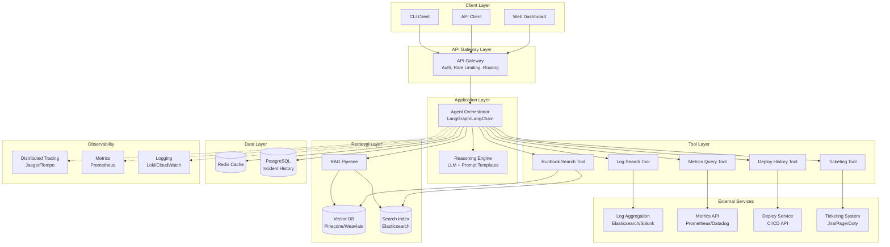
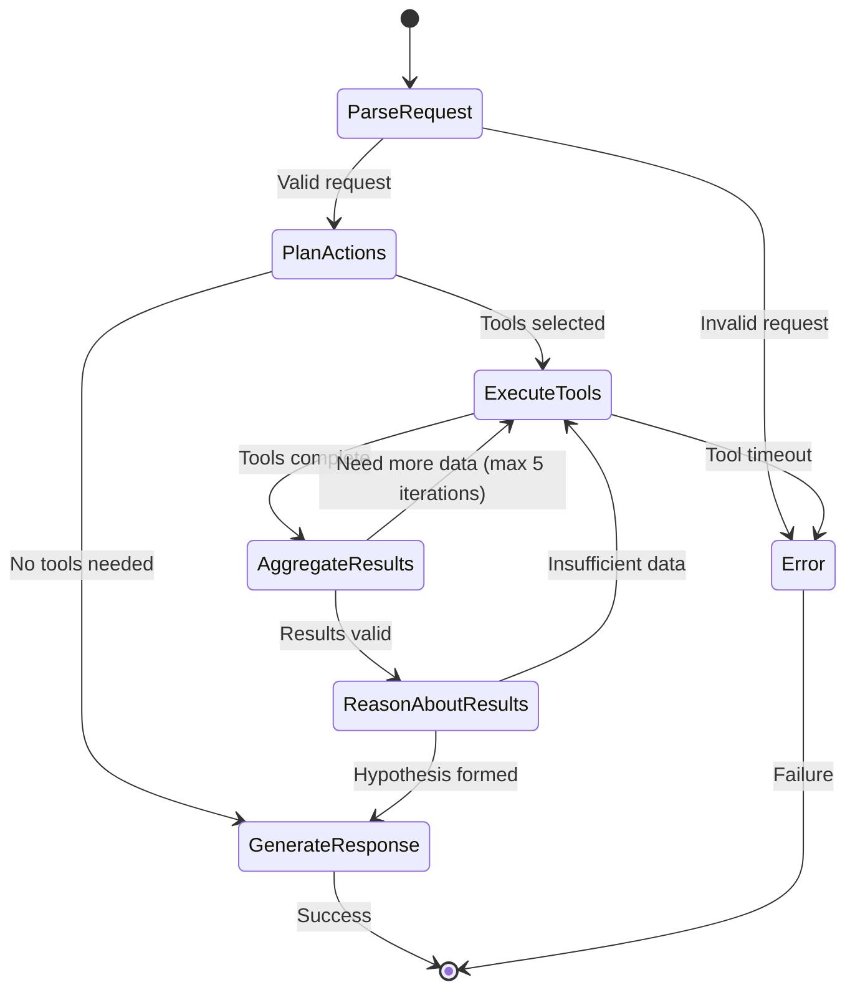
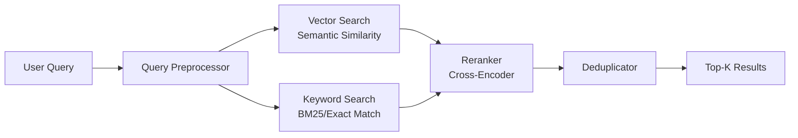
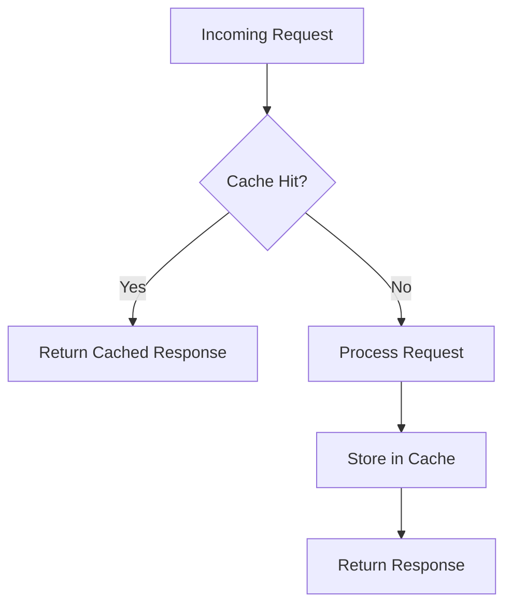
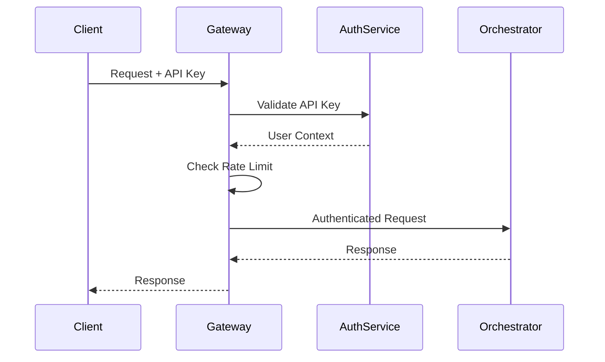
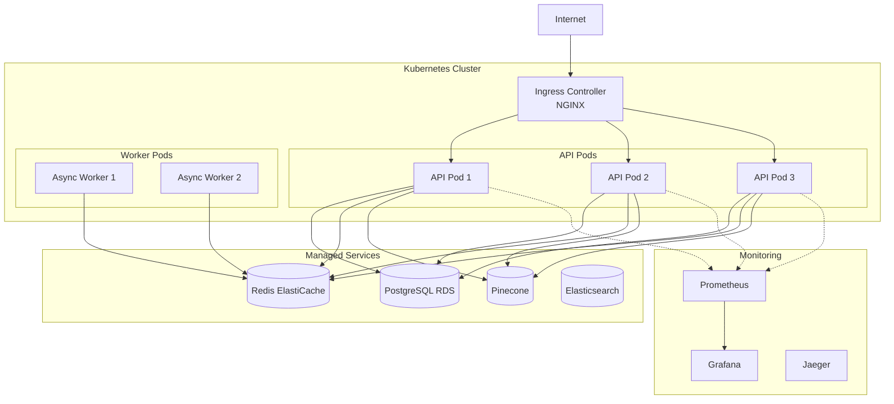

# Ops Copilot - System Design Document

## 1. Architecture Overview



---

## 2. Component Breakdown

### 2.1 API Gateway

**Responsibilities:**
- Authentication & authorization
- Rate limiting (100 req/hour per user)
- Request validation
- Load balancing
- CORS handling

**Technology:** 
- **Primary**: FastAPI with middleware
- **Alternative**: Kong, AWS API Gateway

**Key Features:**
- JWT token validation
- API key management
- Request/response logging
- Circuit breaker pattern

---

### 2.2 Agent Orchestrator

**Responsibilities:**
- Coordinate tool execution
- Manage agent reasoning loop
- Enforce iteration budgets
- Handle retries and timeouts
- Aggregate results

**Technology:**
- **Framework**: LangGraph (for state management) or LangChain
- **LLM**: GPT-4 or Claude 3.5 Sonnet
- **Language**: Python 3.11+

**State Machine:**



**Iteration Budget Enforcement:**
```python
class IterationBudget:
    MAX_REASONING_LOOPS = 5
    MAX_TOOL_RETRIES = 3
    TOTAL_TIMEOUT = 30  # seconds
    
    def __init__(self):
        self.iterations = 0
        self.start_time = time.time()
    
    def can_continue(self) -> bool:
        return (
            self.iterations < self.MAX_REASONING_LOOPS and
            time.time() - self.start_time < self.TOTAL_TIMEOUT
        )
```

---

### 2.3 RAG Pipeline (Hybrid Retrieval)

**Architecture:**



**Implementation Details:**

#### Vector Search
- **Embedding Model**: `text-embedding-3-large` (OpenAI) or `e5-large-v2`
- **Vector DB**: Pinecone (managed) or Weaviate (self-hosted)
- **Dimensions**: 1536 (OpenAI) or 1024 (e5)
- **Index Type**: HNSW (Hierarchical Navigable Small World)
- **Top-K**: Retrieve top 20 candidates

#### Keyword Search
- **Engine**: Elasticsearch
- **Algorithm**: BM25 with custom scoring
- **Fields**: Title (boost: 3.0), content (boost: 1.0), tags (boost: 2.0)
- **Filters**: Service name, incident type, severity
- **Top-K**: Retrieve top 20 candidates

#### Reranking
- **Model**: `cross-encoder/ms-marco-MiniLM-L-12-v2`
- **Input**: Query + candidate pairs
- **Output**: Relevance scores (0-1)
- **Final Top-K**: 5 results

#### Deduplication
- **Method**: Cosine similarity threshold (> 0.95)
- **Strategy**: Keep highest-ranked duplicate

**Performance Optimization:**
- Cache embeddings for common queries (Redis, TTL: 1 hour)
- Batch vector lookups
- Async parallel search (vector + keyword)

---

### 2.4 Tool Layer

Each tool follows a common interface:

```python
from typing import Dict, Any, Optional
from pydantic import BaseModel

class ToolInput(BaseModel):
    """Base class for tool inputs"""
    pass

class ToolOutput(BaseModel):
    """Base class for tool outputs"""
    success: bool
    data: Optional[Dict[str, Any]]
    error: Optional[str]
    execution_time_ms: int

class BaseTool:
    def __init__(self, timeout: int = 10):
        self.timeout = timeout
        self.retry_count = 3
    
    async def execute(self, input: ToolInput) -> ToolOutput:
        """Execute tool with timeout and retry logic"""
        pass
    
    def validate_input(self, input: ToolInput) -> bool:
        """Validate input parameters"""
        pass
```

#### Tool Specifications

##### 1. Log Search Tool
```python
class LogSearchInput(ToolInput):
    query: str  # Search query (supports regex)
    time_range: str  # e.g., "last_1h", "last_24h"
    service: Optional[str]  # Filter by service name
    severity: Optional[str]  # ERROR, WARN, INFO
    max_results: int = 100

class LogSearchOutput(ToolOutput):
    logs: List[Dict[str, Any]]  # [{timestamp, message, service, level}]
    total_count: int
    query_time_ms: int
```

**API Integration:**
- Elasticsearch Query DSL
- Timeout: 10s
- Pagination: Max 3 pages (300 logs)

##### 2. Metrics Query Tool
```python
class MetricsQueryInput(ToolInput):
    metric_name: str  # e.g., "http_requests_total"
    time_range: str
    aggregation: str  # avg, sum, max, min, p95, p99
    dimensions: Optional[Dict[str, str]]  # {service: "api", region: "us-east"}

class MetricsQueryOutput(ToolOutput):
    data_points: List[Dict[str, Any]]  # [{timestamp, value}]
    metadata: Dict[str, Any]
```

**API Integration:**
- PromQL for Prometheus
- Datadog Query Language for Datadog
- Timeout: 5s

##### 3. Deploy History Tool
```python
class DeployHistoryInput(ToolInput):
    service: str
    time_range: str
    limit: int = 10

class DeployHistoryOutput(ToolOutput):
    deployments: List[Dict[str, Any]]  # [{version, timestamp, author, status}]
```

##### 4. Runbook Search Tool
```python
class RunbookSearchInput(ToolInput):
    query: str
    service: Optional[str]
    top_k: int = 5

class RunbookSearchOutput(ToolOutput):
    runbooks: List[Dict[str, Any]]  # [{id, title, content, score, url}]
```

##### 5. Ticketing Tool
```python
class TicketingInput(ToolInput):
    action: str  # "create", "update", "get"
    incident_id: Optional[str]
    title: Optional[str]
    description: Optional[str]
    priority: Optional[str]

class TicketingOutput(ToolOutput):
    ticket_id: str
    ticket_url: str
```

---

### 2.5 Reasoning Engine

**Prompt Template Structure:**

```python
SYSTEM_PROMPT = """
You are an expert SRE assistant helping diagnose production incidents.

Your goal is to:
1. Analyze the incident description and available data
2. Form a hypothesis about the root cause
3. Suggest concrete next actions
4. Provide executable commands when applicable

CRITICAL RULES:
- Always cite your sources (logs, metrics, runbooks)
- Be concise and actionable
- Prioritize high-impact actions
- Never hallucinate - if you don't know, say so
- Limit reasoning to 5 iterations maximum

Available tools: {tools}
"""

USER_PROMPT_TEMPLATE = """
INCIDENT DESCRIPTION:
{incident_description}

AVAILABLE DATA:
{context}

Based on the above, provide:
1. Your hypothesis about what's broken and why
2. Next actions to take (prioritized)
3. Specific commands to run (if applicable)
4. Citations for all claims

Respond in the required JSON format.
"""
```

**LLM Configuration:**
```python
llm_config = {
    "model": "gpt-4-turbo-preview",  # or "claude-3-5-sonnet-20241022"
    "temperature": 0.1,  # Low for consistency
    "max_tokens": 2000,
    "response_format": {"type": "json_object"},  # Structured output
    "timeout": 20,  # seconds
}
```

---

## 3. Data Models

### 3.1 Database Schema (PostgreSQL)

```sql
-- Incident history table
CREATE TABLE incidents (
    id UUID PRIMARY KEY DEFAULT gen_random_uuid(),
    incident_id VARCHAR(255) UNIQUE NOT NULL,
    description TEXT NOT NULL,
    hypothesis TEXT,
    resolution TEXT,
    status VARCHAR(50) NOT NULL,  -- open, investigating, resolved
    severity VARCHAR(20),  -- critical, high, medium, low
    affected_services TEXT[],
    created_at TIMESTAMP NOT NULL DEFAULT NOW(),
    resolved_at TIMESTAMP,
    duration_seconds INTEGER,
    embedding VECTOR(1536),  -- For similarity search
    metadata JSONB
);

CREATE INDEX idx_incidents_created_at ON incidents(created_at DESC);
CREATE INDEX idx_incidents_status ON incidents(status);
CREATE INDEX idx_incidents_embedding ON incidents USING ivfflat (embedding vector_cosine_ops);

-- Query history for analytics
CREATE TABLE query_history (
    id UUID PRIMARY KEY DEFAULT gen_random_uuid(),
    user_id VARCHAR(255) NOT NULL,
    query TEXT NOT NULL,
    response JSONB NOT NULL,
    tools_used TEXT[],
    latency_ms INTEGER,
    created_at TIMESTAMP NOT NULL DEFAULT NOW()
);

CREATE INDEX idx_query_history_user ON query_history(user_id);
CREATE INDEX idx_query_history_created_at ON query_history(created_at DESC);

-- Runbook metadata
CREATE TABLE runbooks (
    id UUID PRIMARY KEY DEFAULT gen_random_uuid(),
    title VARCHAR(500) NOT NULL,
    content TEXT NOT NULL,
    service VARCHAR(255),
    tags TEXT[],
    last_updated TIMESTAMP NOT NULL,
    author VARCHAR(255),
    version INTEGER DEFAULT 1,
    embedding VECTOR(1536)
);

CREATE INDEX idx_runbooks_service ON runbooks(service);
CREATE INDEX idx_runbooks_embedding ON runbooks USING ivfflat (embedding vector_cosine_ops);
```

### 3.2 Cache Schema (Redis)

```python
# Cache keys structure
CACHE_KEYS = {
    "runbook_embedding": "runbook:emb:{runbook_id}",  # TTL: 24h
    "query_result": "query:result:{query_hash}",  # TTL: 1h
    "metrics_data": "metrics:{metric_name}:{time_range}",  # TTL: 5m
    "rate_limit": "ratelimit:{user_id}",  # TTL: 1h
}
```

---

## 4. API Design

### 4.1 REST API Endpoints

#### POST /api/v1/analyze
**Description:** Analyze an incident and get recommendations

**Request:**
```json
{
  "incident_description": "API service returning 500 errors since 2pm",
  "incident_id": "INC-12345",  // optional
  "context": {
    "service": "api-gateway",
    "environment": "production",
    "region": "us-east-1"
  },
  "options": {
    "include_commands": true,
    "max_citations": 5
  }
}
```

**Response:** (See structured output in requirements)

**Status Codes:**
- 200: Success
- 400: Invalid request
- 429: Rate limit exceeded
- 500: Internal error
- 504: Timeout

#### GET /api/v1/incidents/{incident_id}
**Description:** Get incident details and analysis

#### POST /api/v1/runbooks/search
**Description:** Search runbooks directly

#### GET /api/v1/health
**Description:** Health check endpoint

---

## 5. Technology Stack

| Component | Technology | Rationale |
|-----------|-----------|-----------|
| **API Framework** | FastAPI | Async support, auto docs, type safety |
| **Agent Framework** | LangGraph | State management, debugging tools |
| **LLM** | GPT-4 Turbo / Claude 3.5 | Best reasoning capabilities |
| **Vector DB** | Pinecone | Managed, scalable, low latency |
| **Search Engine** | Elasticsearch | Industry standard for logs |
| **Cache** | Redis | Fast, supports complex data types |
| **Database** | PostgreSQL + pgvector | ACID compliance, vector support |
| **Message Queue** | Redis Streams | Async task processing |
| **Tracing** | OpenTelemetry + Jaeger | Distributed tracing standard |
| **Metrics** | Prometheus + Grafana | Time-series metrics |
| **Logging** | Structured logging (JSON) | Easy parsing and analysis |
| **Deployment** | Docker + Kubernetes | Container orchestration |
| **CI/CD** | GitHub Actions | Automation |

---

## 6. Scalability & Performance

### 6.1 Caching Strategy



**Cache Layers:**
1. **L1 - In-Memory (LRU)**: 100 most recent queries (TTL: 5m)
2. **L2 - Redis**: Query results (TTL: 1h), embeddings (TTL: 24h)
3. **L3 - CDN**: Static runbook content (TTL: 1 week)

### 6.2 Horizontal Scaling

- **Stateless Design**: All state in Redis/PostgreSQL
- **Load Balancing**: Round-robin across API instances
- **Auto-scaling**: Scale based on CPU (>70%) and queue depth (>100)
- **Target**: 3 instances minimum, 10 instances max

### 6.3 Async Processing

```python
# Non-blocking tool execution
async def execute_tools_parallel(tools: List[BaseTool], inputs: List[ToolInput]):
    tasks = [tool.execute(input) for tool, input in zip(tools, inputs)]
    results = await asyncio.gather(*tasks, return_exceptions=True)
    return results
```

---

## 7. Error Handling & Resilience

### 7.1 Circuit Breaker Pattern

```python
from circuitbreaker import circuit

@circuit(failure_threshold=5, recovery_timeout=60)
async def call_external_api(url: str):
    # If 5 failures occur, circuit opens for 60 seconds
    async with httpx.AsyncClient() as client:
        response = await client.get(url, timeout=10)
        return response.json()
```

### 7.2 Graceful Degradation

| Failure Scenario | Fallback Strategy |
|------------------|-------------------|
| Vector DB down | Use keyword search only |
| Metrics API timeout | Skip metrics, use logs only |
| LLM API error | Return cached similar incident |
| All tools fail | Return runbook search results |

### 7.3 Timeout Hierarchy

```
Total Request Timeout: 30s
├── Agent Reasoning: 25s
│   ├── Tool Execution: 20s
│   │   ├── Log Search: 10s
│   │   ├── Metrics Query: 5s
│   │   ├── Deploy History: 3s
│   │   └── Runbook Search: 5s
│   └── LLM Generation: 5s
└── Response Formatting: 5s
```

---

## 8. Security Architecture

### 8.1 Authentication Flow



### 8.2 Authorization Model

```python
class Permission(Enum):
    READ_INCIDENTS = "read:incidents"
    WRITE_INCIDENTS = "write:incidents"
    EXECUTE_COMMANDS = "execute:commands"  # Requires approval
    ADMIN = "admin"

class User:
    id: str
    email: str
    team: str
    permissions: List[Permission]
```

### 8.3 Data Protection

- **PII Redaction**: Regex-based scrubbing of emails, IPs, API keys in logs
- **Encryption at Rest**: PostgreSQL TDE, encrypted Redis
- **Encryption in Transit**: TLS 1.3 for all APIs
- **Audit Logging**: All actions logged with user context

---

## 9. Observability

### 9.1 Key Metrics

```python
# Prometheus metrics
REQUEST_LATENCY = Histogram(
    'opscopilot_request_duration_seconds',
    'Request latency',
    buckets=[0.1, 0.5, 1, 2, 5, 10, 20, 30]
)

TOOL_EXECUTION_COUNT = Counter(
    'opscopilot_tool_executions_total',
    'Tool execution count',
    ['tool_name', 'status']
)

ACTIVE_REQUESTS = Gauge(
    'opscopilot_active_requests',
    'Number of active requests'
)

LLM_TOKEN_USAGE = Counter(
    'opscopilot_llm_tokens_total',
    'LLM token usage',
    ['model', 'type']  # type: prompt, completion
)
```

### 9.2 Distributed Tracing

```python
from opentelemetry import trace
from opentelemetry.instrumentation.fastapi import FastAPIInstrumentor

tracer = trace.get_tracer(__name__)

@tracer.start_as_current_span("analyze_incident")
async def analyze_incident(request: AnalyzeRequest):
    with tracer.start_as_current_span("runbook_search"):
        runbooks = await search_runbooks(request.query)
    
    with tracer.start_as_current_span("log_search"):
        logs = await search_logs(request.query)
    
    # Spans automatically linked in trace
```

### 9.3 Alerting Rules

```yaml
# Prometheus alerting rules
groups:
  - name: opscopilot
    rules:
      - alert: HighLatency
        expr: histogram_quantile(0.95, opscopilot_request_duration_seconds) > 10
        for: 5m
        annotations:
          summary: "p95 latency exceeds 10s"
      
      - alert: HighErrorRate
        expr: rate(opscopilot_errors_total[5m]) > 0.05
        for: 5m
        annotations:
          summary: "Error rate exceeds 5%"
```

---

## 10. Deployment Architecture

### 10.1 Kubernetes Deployment

```yaml
apiVersion: apps/v1
kind: Deployment
metadata:
  name: opscopilot-api
spec:
  replicas: 3
  selector:
    matchLabels:
      app: opscopilot-api
  template:
    metadata:
      labels:
        app: opscopilot-api
    spec:
      containers:
      - name: api
        image: opscopilot:latest
        resources:
          requests:
            cpu: "500m"
            memory: "1Gi"
          limits:
            cpu: "2000m"
            memory: "4Gi"
        env:
        - name: REDIS_URL
          valueFrom:
            secretKeyRef:
              name: opscopilot-secrets
              key: redis-url
        livenessProbe:
          httpGet:
            path: /health
            port: 8000
          initialDelaySeconds: 30
          periodSeconds: 10
        readinessProbe:
          httpGet:
            path: /health
            port: 8000
          initialDelaySeconds: 5
          periodSeconds: 5
```

### 10.2 Infrastructure Components



---

## 11. Cost Estimation

### 11.1 Monthly Cost Breakdown

| Component | Specification | Cost/Month |
|-----------|--------------|------------|
| **Compute (K8s)** | 3x t3.large (2 vCPU, 8GB) | $150 |
| **PostgreSQL RDS** | db.t3.medium (2 vCPU, 4GB) | $60 |
| **Redis ElastiCache** | cache.t3.medium (2 vCPU, 3.2GB) | $50 |
| **Pinecone** | 1M vectors, 100 queries/day | $70 |
| **Elasticsearch** | 3-node cluster (t3.small) | $120 |
| **LLM API (GPT-4)** | 10k req/day, avg 2k tokens | $300 |
| **Data Transfer** | 500GB/month | $45 |
| **Monitoring** | Prometheus + Grafana Cloud | $50 |
| **Total** | | **~$845/month** |

### 11.2 Cost Optimization Strategies

1. **Caching**: Reduce LLM calls by 40% → Save $120/month
2. **Spot Instances**: Use for worker pods → Save $50/month
3. **Reserved Instances**: 1-year commit → Save $100/month
4. **Optimized Target**: **~$575/month**

---

## 12. Migration & Rollout Plan

### Phase 1: MVP (Weeks 1-4)
- ✅ Core RAG pipeline
- ✅ 2 tools (logs, runbooks)
- ✅ Basic API
- ✅ Single-team pilot

### Phase 2: Beta (Weeks 5-8)
- ✅ All 5 tools integrated
- ✅ Evaluation framework
- ✅ Multi-team rollout (3 teams)
- ✅ Performance optimization

### Phase 3: GA (Weeks 9-12)
- ✅ Full observability
- ✅ Auto-scaling
- ✅ Documentation
- ✅ Company-wide rollout

---

## 13. Risks & Mitigations

| Risk | Impact | Probability | Mitigation |
|------|--------|-------------|------------|
| LLM hallucinations | High | Medium | Strict citation requirements, eval framework |
| External API downtime | Medium | High | Circuit breakers, fallbacks, caching |
| Cost overruns | Medium | Medium | Budget alerts, query limits, caching |
| Slow adoption | Low | Medium | Training, documentation, success stories |
| Security breach | High | Low | Auth, encryption, audit logs, pen testing |

---

This system design provides a production-ready architecture for the Ops Copilot incident-response assistant, balancing performance, reliability, and cost-effectiveness.
